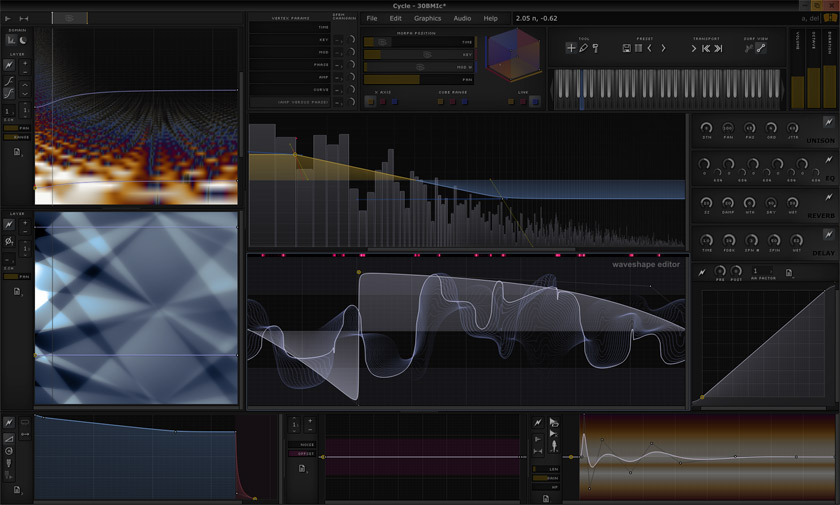
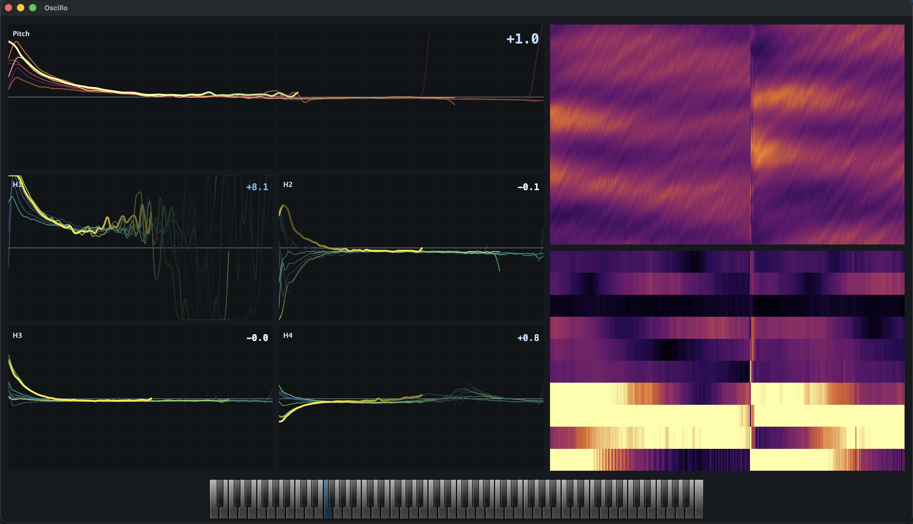

# Amaranth

Amaranth is a JUCE/CMake monorepo for Amaranth Audio applications and their
shared engine code. The root project builds four main areas:

- `lib/`: `AmaranthLib`, the shared application, DSP, mesh, UI, interaction,
  audio, persistence, and utility code used by the apps.
- `cycle/`: Cycle, the flagship synthesizer and plugin project.
- `oscillo/`: Oscillo, a standalone piano tuner and pitch-analysis utility.
- `installer/`: a general-use product installer that reads product manifests
  such as `cycle/installer.json` and `oscillo/installer.json`.



## Projects

### Cycle

Cycle is Amaranth Audio's flagship synthesizer. It uses editable waveform,
spectral, envelope, guide-curve, and effect meshes to model evolving timbre over
time, pitch, and performance dimensions. It builds as a standalone app and, for
plugin presets, as a plugin target.

Read more in [`cycle/README.md`](cycle/README.md).

### Oscillo

Oscillo is a standalone tuner and pitch-analysis tool for piano work. It listens
to microphone input, tracks real-time pitch, and visualizes period, spectrum,
phase, drift, and note history against a keyboard reference.



Read more in [`oscillo/README.md`](oscillo/README.md).

### AmaranthLib

`AmaranthLib` is not a separate product. It is the common codebase for Amaranth
apps: mesh geometry and rasterization, curve editing, vectorized buffers, FFT
and convolution helpers, pitch tracking, UI panels/widgets, app settings,
document persistence, undo/interaction infrastructure, and shared audio
plumbing.

### Installer

The installer app is intentionally product-neutral. It owns the shared installer
UI, EULA flow, manifest schema, saved field handling, and artifact-copy logic;
each product owns its own manifest and package inputs.

Read more in [`installer/README.md`](installer/README.md).

## Repository Layout

```text
.
├── CMakeLists.txt
├── CMakePresets.json
├── cycle/
├── docs/
├── installer/
├── lib/
├── oscillo/
└── scripts/
```

## Prerequisites

For a normal developer checkout, do not install JUCE, the VST3 SDK, or Catch2 by
hand first. Start from the repository root and use the scripts below.

Required up front:

- Git
- CMake 3.29 or newer
- A C++17 compiler
- macOS: Xcode Command Line Tools; builds use Accelerate/vDSP
- Linux: common desktop/audio development packages plus Intel IPP

The bootstrap script installs or updates the SDK-style dependencies under
`$INSTALL_ROOT` or `~/SDKs` by default:

- JUCE
- VST3 SDK
- Catch2
- Intel IPP on Linux

## Setup

From the repository root:

```sh
git clone https://github.com/DavenH/Amaranth.git
cd Amaranth
./scripts/install_deps.sh
./scripts/make_env.sh
```

`make_env.sh` writes the required root `.env` file with SDK paths such as:

```sh
JUCE_MODULES_DIR=...
JUCE_ROOT=...
VST3_SDK_DIR=...
CATCH2_CMAKE_DIR=...
AUDIO_PLUGIN_HOST_BUILD_DIR=...
IPP_DIR=...
```

On macOS, `IPP_DIR` is intentionally empty because the build uses
Accelerate/vDSP.

## Build

List available presets:

```sh
cmake --list-presets
```

Configure and build standalone debug apps:

```sh
cmake --preset standalone-debug
cmake --build --preset standalone-debug --parallel 10
```

Build the Cycle plugin target:

```sh
cmake --preset plugin-debug
cmake --build --preset plugin-debug --parallel 10
```

Build all test executables:

```sh
cmake --preset tests
cmake --build --preset tests --parallel 10
```

## Test

CTest is the canonical test entrypoint:

```sh
ctest --preset tests
```

Useful focused examples:

```sh
cmake --build --preset tests --target AmaranthLib_tests --parallel 10
ctest --preset tests -R "Buffer window functions"
```

Catch2 is the underlying test framework, with tests discovered through
`catch_discover_tests(...)`.

## Packaging

The installer packaging targets create product zips from product manifests:

```sh
cmake --build --preset standalone-release --target Oscillo_installer_zip --parallel 10
cmake --build --preset standalone-release --target Cycle_installer_zip --parallel 10
```

`Cycle_installer_zip` expects both standalone and plugin release artifacts to
exist. Build `standalone-release` and `plugin-release` first for a complete
Cycle package.
