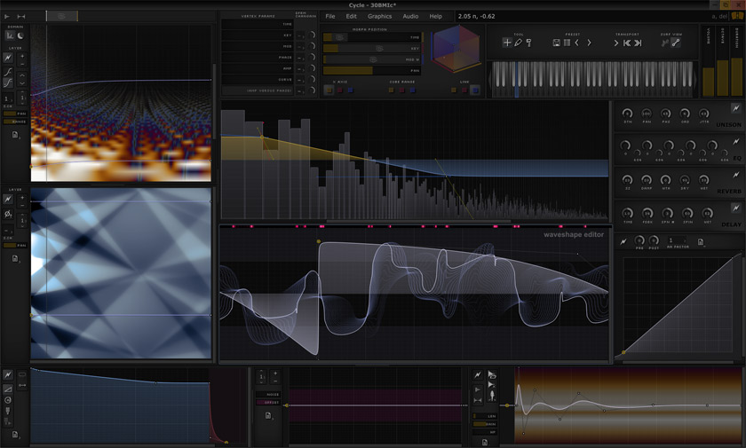

# **Repository Structure**

This repository is a monorepo that contains multiple projects and a shared library.

* **cycle/**: The main **Cycle** project.
* **oscillo/**: A separate **Oscillo** project.
* **lib/**: The **Amaranth** library, which contains shared code used by the other projects.
* CMakeLists.txt: The root CMake file for the entire repository.
* CMakePresets.json: A file containing preset configurations for CMake.

```
.
├── CMakeLists.txt
├── CMakePresets.json
├── cycle/
├── oscillo/
└── lib/
```

# **Cycle**

Cycle is **Amaranth Audio**'s flagship audio synthesizer built with the JUCE framework and CMake. 



## **Prerequisites**

Before you begin, you will need to install the following dependencies:

* **CMake:** A cross-platform build system.
* **A C++ compiler:** Such as GCC, Clang, or Visual Studio.
* **Git:** For cloning the repository.
* **JUCE:** The C++ framework used for the project.
* **VST3 SDK:** The SDK for building VST3 plugins.
* **Catch2:** A C++ test framework.
* **Intel IPP (Linux only):** Intel Integrated Performance Primitives, for optimized performance.

## **Setup Instructions**

1. **Clone the Repository:**  
   `git clone https://github.com/DavenH/Amaranth.git`  
   `cd cycle`

2. **Install Dependencies:**
   1. `./scripts/install_deps.sh`
      . This will install these SDKs as needed: JUCE, VST3, Catch2, and Intel IPP (on linux)  
   2. `./scripts/make_env.sh`
   
   The script will create a .env file with content similar to this:
```bash
   # Amaranth SDK Locations  
   # Generated on <date>  
   # Platform: <OS_NAME>

   JUCE_MODULES_DIR=<path_to_juce_modules>  
   VST3_SDK_DIR=<path_to_vst3_sdk>  
   CATCH2_CMAKE_DIR=<path_to_catch2>

   # Linux specific  
   # IPP_DIR=<path_to_intel_ipp>
```
## **Build Instructions**

This project uses CMake for building. You can use the CMakePresets.json file for common build configurations, or you can build manually.

### **Using CMake Presets**

To see the available presets, run:  
`cmake --list-presets`

To configure and build with a specific preset, for example, `standalone-debug`, run:  
`cmake --preset standalone-debug`  
`cmake --build --preset standalone-debug`

