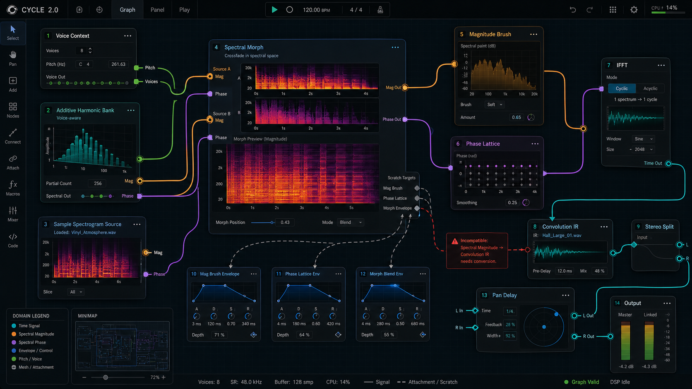
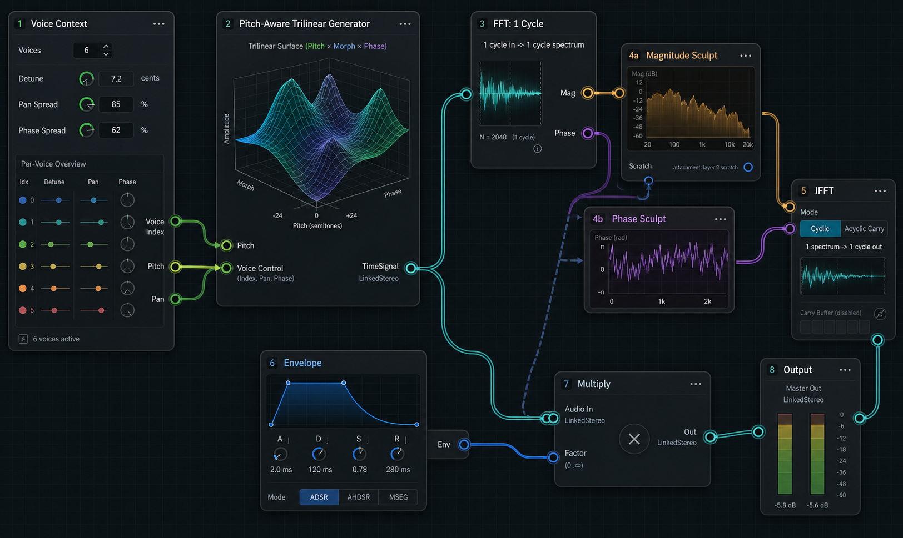

# Cycle 2.0

Cycle 2.0 is a sister project to Cycle, built around a node-based workflow for explicit audio, spectral, mesh, envelope, pitch, voice, and scratch-attachment routing.

## Build and Run

From the repository root:

```bash
cmake --preset standalone-debug
cmake --build build/standalone-debug --target CycleV2 --parallel 10
open build/standalone-debug/cycle-v2/CycleV2.app
```

## UI Smoke Checks

The shared `scripts/capture_cycle_ui.sh` helper defaults to the Cycle 1.x app
at `build/standalone-debug/cycle/Cycle.app`. When checking Cycle 2.0 UI work,
override the app path and process metadata explicitly:

```bash
CYCLE_APP_PATH="$PWD/build/standalone-debug/cycle-v2/CycleV2.app" \
CYCLE_PROCESS_NAME=CycleV2 \
CYCLE_APP_BUNDLE_ID=com.amaranthaudio.cycle-v2 \
    scripts/capture_cycle_ui.sh /tmp/cycle-v2-ui.png /tmp/cycle-v2-logs.txt
```

Cycle 2.0 also has an in-app agent automation runner for deterministic smoke
checks:

```bash
cmake --build build/standalone-debug --target CycleV2 --parallel 10
scripts/run_cycle_v2_agent.sh \
    scripts/fixtures/cycle-v2-agent-readonly.json \
    /tmp/cycle-v2-agent-readonly-report.json \
    /tmp/cycle-v2-agent-readonly-log.txt
```

Run the current Cycle 2.0 smoke set with:

```bash
scripts/run_cycle_v2_agent_smokes.sh
```

OpenGL-backed Trimesh panels need runner-side OS capture rather than app-side
component snapshots. Enable that visual artifact with:

```bash
CYCLE_V2_AGENT_SMOKE_OS_SCREENSHOT=1 scripts/run_cycle_v2_agent_smokes.sh
```

This writes `mesh-controls-os.png` under the smoke artifact directory after
preflighting Screen Recording permission. The smoke then runs
`scripts/assert_png_stats.py` against the 3D and 2D panel regions so black GL
captures fail automatically.

The first command surface supports `snapshotState`, `inspectTargets`,
`listAssertionPaths`, `assertState`, `exportGraph`, `openGraph`, `saveGraph`,
`openNodeEditor`, `openMeshPopup`, `addNode`, `moveNode`, `connectPorts`,
`deleteNode`, `deleteEdge`, `setNodeParameter`, `inspectNodeControls`,
`setMorphSlider`, `setPrimaryAxis`, `toggleLink`, `selectVertex`,
`setVertexParameter`, `pointer`, `assertNodeParameter`, `screenshot`,
`waitForIdle`, and `quit`. Reports are JSON files with per-command results plus
a final snapshot. Mesh controls currently cover opening a Trimesh expanded
editor, setting yellow/red/blue morph sliders, primary-axis selection, link
toggles, vertex selection, and vertex parameter sliders by node id. Pointer
replay currently targets registered top-level areas such as `canvas`.

## Current Editor Controls

- drag empty canvas: pan
- trackpad scroll / mouse wheel: pan
- trackpad pinch: zoom around cursor
- drag a node: move it
- drag from one port to another: connect compatible ports
- click palette item: add a node at the viewport center
- click cable: select edge
- double-click node: open or close the expanded node panel
- click empty canvas or press `Esc`: dismiss expanded panel and selection
- `Delete` / `Backspace`: delete selected node or edge
- `Cmd/Ctrl+Z`: undo
- `Cmd/Ctrl+Shift+Z` or `Cmd/Ctrl+Y`: redo
- `Cmd/Ctrl+S`: save graph snapshot
- `Cmd/Ctrl+O`: load graph snapshot

## Tests

```bash
cmake --preset tests
cmake --build build/tests --target CycleV2_tests --parallel 10
ctest --test-dir build/tests -R "Demo graph|Runtime|Audio signal|Channel layouts|Compiler" -V
```

## Design Direction

The editor should feel like a studio canvas rather than a legacy panel UI:

- large dark grid canvas with minimap navigation
- soft, routed cables that avoid node bodies where possible
- domain-colored ports and cables for time, spectral magnitude, spectral phase, envelope/control, mesh, pitch, and voice routing
- explicit stereo split/join nodes for visible left/right channel routing
- explicit scratch attachment ports so hidden Cycle 1.x scratch assignments become visible and traceable
- rich per-node previews: trilinear mesh surfaces, 2D mesh slices, waveform/cyclogram views, spectrograms, spectral magnitude/phase graphs, envelopes, and meters
- double-click expansion into a larger editor for the selected node

## Visual References

These generated UI mockups are visual references, not implementation snapshots. They capture the intended density, routing clarity, node-preview richness, and studio-canvas atmosphere.




