# Cycle: A Technical Deep-Dive

Welcome to Cycle, Amaranth Audio's flagship synthesizer!

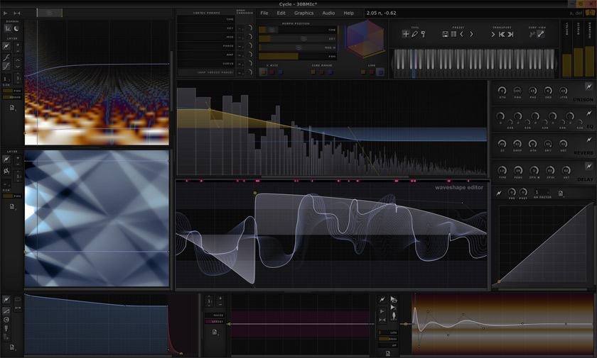

This document provides a look at the architecture and signal processing that make Cycle a powerful and unique instrument for sound design.

## Why _This_ Design? 

The reason for this particular set of features is that Cycle has this basic design goal:

> Cycle should be able to model **any** sound

In particular, stubborn sound design targets like Electric Guitars, Sitars, Pianos.
And additionally for instrument-based sounds, it needs to capture their main dimensions of expression.

These requirements imply precise waveform-level and spectrum-level control, both instantaneously and over time, which is
why we need a multidimensional waveform- and spectral-surface, the power of unlimited layers.
To capture the distribution of timbres an instrument can produce, smooth morphing between timber states is required.
I decided that transforming over time was not enough; that could capture the decay of a piano note, but not the
difference in brightness as it responds to velocity. 

In addition to that, most instruments have a natural change in timber along the pitch spectrum, from richness in the bass tones to more bell-like simplicity in the upper notes.
This means that we need 3 dimensions for the timbre to freely morph along, to capture the bare minimum of an
instrument's dynamism.

For many 'breathy' sound targets, we need a way to insert noise and chaos into the tone. This is why we have the **Paths** concept -- a way to create reusable parts of waveshapes / filters -- which among other things, gives us the ability to introduce random paths into the waveform or spectrum, or envelope.

I also wanted it to be relatively easy to create and understand, so we have immediate UI feedback -- visualizing the full processing pipeline. 
We also have a custom-built **curve design** with many desirable audio-tailored properties.

While technically feasible without it, oddball features like the **Scratch Envelope** became necessary to quickly make non-linear curves in the waveform evolution, like pluck sounds. 

## Foundational Concept: Waveform Unwrapping

This conceptual transformation takes a 1-D periodic signal and re-expresses it in a two-dimensional space. 
This is how Cycle presents evolving waveshapes: as a 3D surface.

This method is useful for visualizing changes in waveform shape across cycles, making temporal variations in periodic signals easier to interpret.

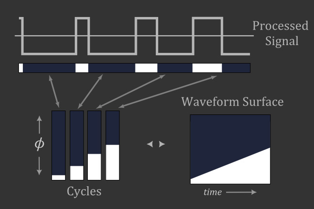

### How does it work?
- **Cycle Segmentation** – The signal is divided into individual cycles based on its periodicity.
- **Phase Wrapping** – Each cycle is mapped onto a normalized phase axis (φ), running from 0 to 1. This aligns all cycles vertically so that identical phases from different cycles line up.
- **Stacked Cycles** – The vertically stacked cycles form columns, with amplitude represented along the vertical axis and successive cycles arranged horizontally.
- **Waveform Surface** – By arranging the stacked cycles side-by-side, the 1-D waveform is transformed into a 2-D “surface” that reveals how the waveform evolves over time while preserving intra-cycle structure.

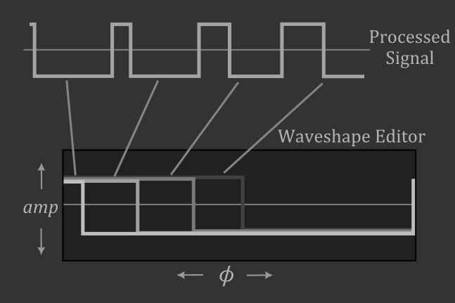

## The Mesh
### Curve Design: Beyond Bézier

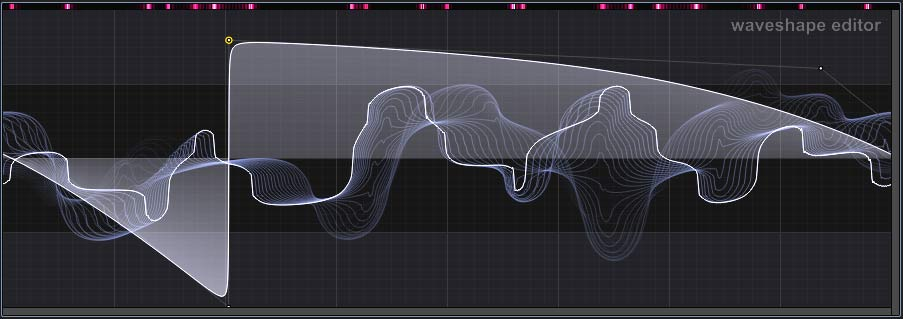

In Cycle, the curves that connect user-defined points (or vertices) are not traditional Bézier curves. While they serve a similar purpose of creating smooth transitions, their underlying implementation is different, offering a unique feel and behavior.

The curve design targeted these properties:
- **Locality**: the sharpness of any part of the curve can be adjusted without significantly influencing the rest of the curve
- **Ease** of producing Sine, Square, Triangle, Sawtooth shapes, and smooth variations between these
- **High continuity**: differentiating the curve several times should not discrete steps; this is crucial for preventing unwanted harmonic properties in raw waveforms
 
#### Technical details
Instead of being defined by control points that pull the curve, as in a Bézier spline, Cycle's curves are generated through a series of transformations (scaling, shearing, rotation) applied to a pre-calculated table of "curvelets" (`Curve::calcTable`). This table-based approach, combined with a custom interpolation function (`Curve::function`, `MeshRasterizer::transferTable`), defines the fundamental shape and curvature.

When you place a vertex, Cycle creates a `Curve` object defined by three points: `a`, `b`, and `c` (`Intercept` structs). The curve segment is primarily the path from `a` to `c`, with `b` influencing the curvature and sharpness (`b.shp`). The `recalculateCurve` function in `Curve.cpp` performs the necessary affine transformations based on the positions of these three points to generate the final curve shape. This method is distinct from the polynomial equations of Bezier curves and is more akin to a specialized form of spline interpolation, like a Catmull-Rom spline, which is designed to pass through all of its control points smoothly. This results in a highly efficient and predictable way to generate a wide variety of curve shapes.

### Mesh Overview: The "TrilinearCube"

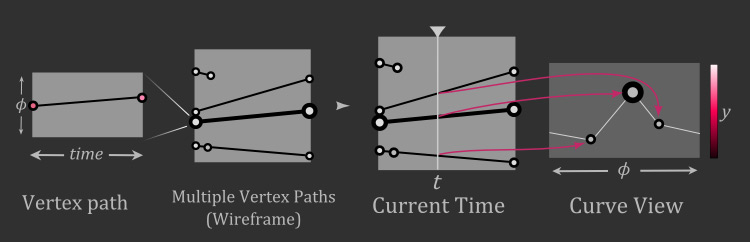

The term "mesh" or "wireframe" in Cycle refers to a complex, multi-dimensional structure that defines the complete sonic potential of a layer. It's more than just a 2D shape; it's a representation of how the sound evolves across several dimensions.

The fundamental building blocks are:
*   **Vertex (`Vertex.h`):** This is a point in a 5-dimensional space, with coordinates for Time, Phase, Amplitude, Red, and Blue. Each vertex you create in the editor is one of these points.
*   **TrilinearCube (`TrilinearCube.h`):** This is the core structural element. It's a hypercube defined by **eight** vertices. Think of it as a 3D cube existing in the **Time**, **Red**, and **Blue** dimensions. Each of its eight corners corresponds to a `Vertex` you place, and the synthesizer interpolates the space within this cube.

A complete "mesh" (`Mesh.h`) is a collection of these `TrilinearCube`s. This structure allows you to define not just a single oscillator shape, but an entire "sound surface" that can be explored and morphed in real-time.

### Waveform/Spectral Surface Morphing

Morphing is the process of navigating the multi-dimensional sound surface you've created with the mesh. The final sound you hear is a 2D "slice" or cross-section of this high-dimensional object.

*   **Morph Position (`MorphPosition.h`):** This object holds the current coordinates in the **Time, Red, and Blue** dimensions. These are the primary controls for morphing.
*   **Rasterization (`MeshRasterizer.cpp`):** This is the process of generating the final 2D waveform or spectral curve from the mesh. The `calcCrossPoints` function is central to this. It iterates through the mesh's `TrilinearCube`s and, based on the current `MorphPosition`, calculates where the "slice" intersects the cube.
*   **Intercepts (`Intercept.h`):** These intersection points are called "intercepts." They represent the points that will define the final 2D curve for a given moment in the morph.

Essentially, as you move the Time, Red, or Blue controls, you are moving a cutting plane through the 3D `TrilinearCube` structure. The shape of the cut changes as you move, resulting in a smooth transition between the sounds defined by the vertices at the corners of the cubes. This allows for complex, evolving timbres where you can, for example, morph a sine wave into a square wave over the 'Time' dimension while simultaneously using the 'Red' and 'Blue' dimensions to introduce other timbral changes.

## Layers

In Cycle, sound is constructed through a system of **Layers**. A layer is essentially a combination of a user-defined curve (or "wireframe") and a set of parameters that instruct Cycle on how to process it. This architecture allows for the imitation of multiple oscillators and filters, providing a versatile and powerful method for sound design. Cycle imposes no limits on the number of layers you can create, offering extensive possibilities for creating intricate sounds.

There are two main categories of layers you can utilize:

### Waveshape Layers

These layers are responsible for defining the fundamental oscillator shape in the **time domain**. The horizontal axis represents phase (from 0 to 360 degrees) and the vertical axis represents amplitude. Each layer is a curve, and all active waveshape layers are summed together to form the final, audible waveshape. This additive process allows for the construction of highly complex and evolving timbres from simpler components.

The true power comes from treating this 2D editor as a slice of the higher-dimensional **Time Surface**. By adding vertices with different **Time**, **Red**, and **Blue** coordinates, you create a morphable, evolving waveform.

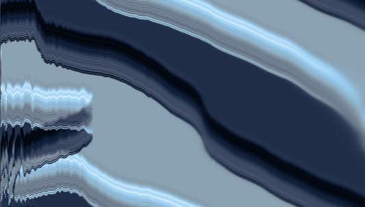

*A simple time surface morphing a sine-like wave to a square-like wave along the Time (yellow) dimension.*

### Spectral Layers

After the initial waveshape is created and its harmonic spectrum is analyzed via an FFT, **spectral layers** are used to modify the sound in the **frequency domain**. These layers give you direct control over the individual harmonics of the sound.

The horizontal axis of a spectral layer represents the harmonic number (from the fundamental up to the Nyquist frequency), and the vertical axis represents either magnitude or phase.

*   **Magnitude Layers:** These function as sophisticated filters or additive equalizers. You can draw precise filter curves, create complex resonant peaks, or even perform additive synthesis by boosting the magnitude of specific harmonics. Depending on their mode, they can either multiply with or add to the amplitude of the harmonics in the spectrum.

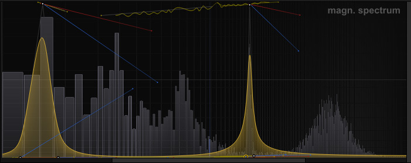

*A Spectral Magnitude layer creating a complex, multi-peak filter shape.*

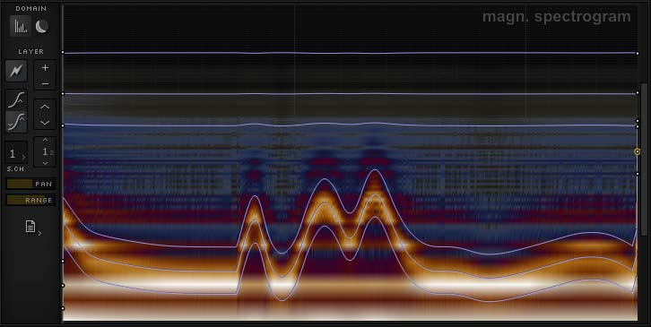

*A Spectral Magnitude surface showing the filter's evolution with time.*

*   **Phase Layers:** These layers give you control over the phase of each harmonic. Manipulating phase can introduce subtle or dramatic character to the sound, creating effects that range from organic detuning and stereo width to breathiness and unique timbral shifts.

Furthermore, each layer includes parameters for per-layer panning, enabling the design of true stereo soundscapes. The combination of these layer types is central to Cycle's sound design workflow, offering deep control over the final timbre and texture.

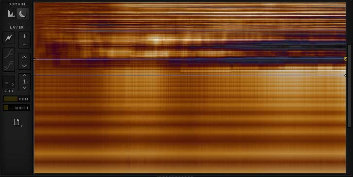

*A Spectral Phase layer being used to create a stereo detuning effect by applying different phase shifts to the left and right channels.*

## Envelopes: Beyond ADSR

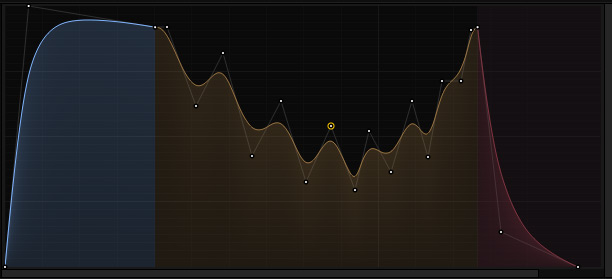

Envelopes are built using the same powerful wireframe system as the oscillators, moving far beyond traditional ADSR (Attack, Decay, Sustain, Release) models.

*   **Envelope Mesh (`EnvelopeMesh.h`):** This is a specialized, non-cyclical `Mesh`. The horizontal axis represents time, and the vertical axis represents the envelope's output level.
*   **Looping and Sustain (`EnvRasterizer.cpp`):** You can designate any point or a series of points within the envelope mesh to act as the sustain or loop section. The `sustainCubes` and `loopCubes` sets in `EnvelopeMesh` store which `TrilinearCube`s are part of these sections.
*   **State Machine (`EnvRasterizer.h`):** The `EnvRasterizer` manages the envelope's state (`NormalState`, `Looping`, `Releasing`). When a note is pressed, it traverses the mesh from the beginning. If it reaches a sustain point, it holds there. If it enters a loop section, it will cycle through that part of the mesh, creating complex, rhythmic modulations similar to an LFO. When the note is released, the rasterizer transitions to the release portion of the envelope.

This approach means you can design envelopes with multiple attack stages, complex looped decays, or intricate release shapes, all with the same intuitive curve editing used for oscillator design.

## Effects

TODO

## Signal Processing Pipeline

Here’s a breakdown of the signal flow, from initial waveform creation to the final output.

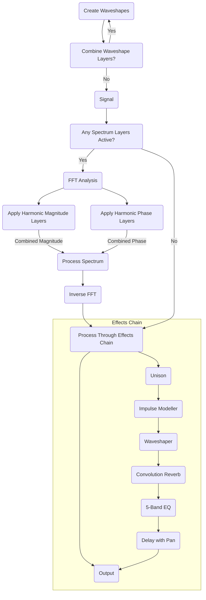