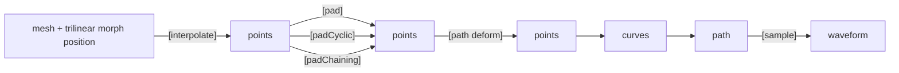
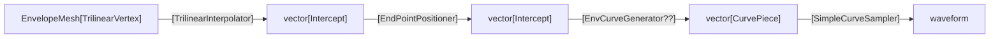
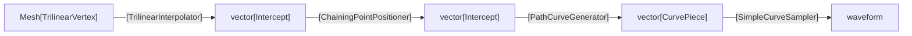

# Mesh Rasterization Refactor.

## Objective
Decompose the legacy `lib/src/Wireframe/OldMeshRasterizer` class into composable modules — Interpolation → Control‑Point Generation → Point
Positioning → Curve Assembly → Sampling — for oscillators and envelopes, preserving current audio behavior. 

## High-Level Pipeline

## Class Diagram (Desired, post-refactor)

CurvePiece becomes a 'sampleable' union of a CurvePath or a Curve

### Rasterizer2D becomes 

### EnvRasterizer becomes

### VoiceMeshRasterizer becomes

### GraphicRasterizer becomes

# Agent Instructions

## Overall plan

Build new clean interfaces and concrete implementations.
Copy logic out of `OldMeshRasterizer` and related classes into those roles, WITHOUT loss of functional fidelity. 
Replace all call sites to use the new pipeline immediately.
Add minimal but strong unit tests + golden‑buffer checks to lock behavior.
No behavior redesign, but naming/param cleanup is permissible.

`PaddingPointPositioner` can take point-list parameter arguments for padding before/after.

## Primary Interfaces

- MeshInterpolator (abstract) → TrilinearInterpolator
- CurveGenerator (abstract) → SimpleCurveGenerator
- PointPositioner (abstract) → PaddingPointPositioner, CyclicPointPositioner, ChainingPointPositioner, EnvPointPositioner, PathPointPositioner
- CurveSampler (abstract) → SimpleCurveSampler
- MeshRasterizer (new, thin facade/orchestrator)

(e.g. CurvePath deforming point positions, applyPaths)

## Current Status

- Many of the class files are already created, most with stubs.
- [ ] **Positioner**
  - [x] `PaddingPointPositioner`: Mostly complete. Call sites not updated. Covers FXRasterizer's point positioning
  - [x] `PathDeformingPositioner`: Mostly complete. Handles applyPaths() calls upon control points
  - [ ] `CyclicPointPositioner`: In progress. Interpolator parameters like `interceptPadding` should go in a new `InterpolatorConfig` struct inside `RasterizationConfig`. Covers TimeGraphicRasterizer
  - [ ] `EnvPointPositioner`: Barely started. Covers EnvRasterizer's point positioning.
  - [ ] `ChainingPointPositioner`: Not started. Covers VoiceMeshRasterizer's point positioning
- [ ] **Interpolator**
  - [ ] `TrilinearInterpolator` In progress. Not yet compiling. Some code 
         concerning `colorPointers` split out to `VisualTrilinearInterpolator`. Need to understand 
         how to inject `CurveConfiguration` object for member point positioner.
  - [ ] `VisualTrilinearInterpolator`: In Progress. Need to update path deformer call pattern.
- [ ] **CurveGenerator**
  - [x] `SimpleCurveGenerator`: Possibly complete?
- [ ] **CurveSampler**
  - [x] `SimpleCurveSampler`: Looks complete.
  - [ ] `PathDeformingCurveSampler`: Not started. Needed for any TrilinearInterpolator users. 
- [ ] **Rasterizer**
  - [ ] `Rasterizer2D` is about half migrated, with some code style issues. Hopefully removable post-refactor. Callers should configure a MeshRasterizer wiht appropriate config.
  - [ ] `Rasterizer` Dependency-injection vs Builder pattern still up in the air
  - [ ] `FXRasterizer`: Hopefully removable post-refactor. Callers should configure a MeshRasterizer wiht appropriate config.
  - [ ] `EnvRasterizer`: Large amount of work left to migrate functionality to composed units.
- [ ] **State**
  - [ ] `RasterizerParameters`: In progress. Collect properties into the appropriate structs. Plumb config objects through pipeline. 

Caller sites need to be replaced by Rasterizer.Builder.

Relevant files are in `lib/src/Wireframe/` and `cycle/src/Wireframe/`.

