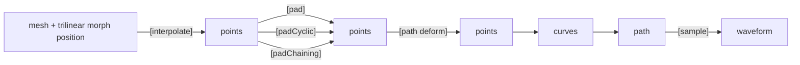
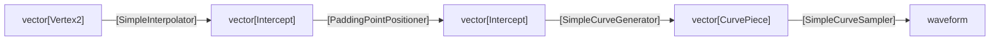
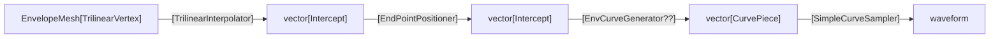
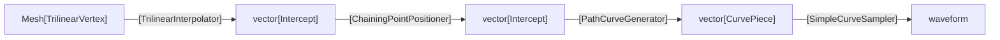

# Mesh Rasterization Refactor.

## Objective
Decompose the legacy `lib/src/Wireframe/OldMeshRasterizer` class into composable modules — Interpolation → Control‑Point Generation → Point
Positioning → Curve Assembly → Sampling — for oscillators and envelopes, preserving current audio behavior. 

## High-Level Pipeline

## Class Diagram (Desired, post-refactor)

CurvePiece becomes a 'sampleable' union of a CurvePath or a Curve

### Rasterizer2D becomes 

### EnvRasterizer becomes

### VoiceMeshRasterizer becomes

### GraphicRasterizer becomes

# Agent Instructions

## Overall plan

Build new clean interfaces and concrete implementations.
Copy logic out of `OldMeshRasterizer` and related classes into those roles, WITHOUT loss of functional fidelity. 
Replace all call sites to use the new pipeline immediately.
Add minimal but strong unit tests + golden‑buffer checks to lock behavior.
No behavior redesign, but naming/param cleanup is permissible.

`PaddingPointPositioner` can take point-list parameter arguments for padding before/after.

## Primary Interfaces

- MeshInterpolator (abstract) → TrilinearInterpolator
- CurveGenerator (abstract) → SimpleCurveGenerator
- PointPositioner (abstract) → PaddingPointPositioner, CyclicPointPositioner, ChainingPointPositioner, EnvPointPositioner, PathPointPositioner
- CurveSampler (abstract) → SimpleCurveSampler
- MeshRasterizer (new, thin facade/orchestrator)

(e.g. CurvePath deforming point positions, applyPaths)

## Current Status

- [ ] **Positioner**
  - [x] `PaddingPointPositioner`: Implemented.
  - [x] `PathDeformingPositioner`: Implemented.
  - [x] `CyclicPointPositioner`: Implemented.
  - [ ] `EnvPointPositioner`: Stubbed, but logic is not implemented.
  - [ ] `ChainingPointPositioner`: Stubbed, but logic is not implemented.
- [x] **Interpolator**
  - [x] `TrilinearInterpolator`: Implemented.
  - [x] `SimpleInterpolator`: Implemented.
  - [x] `BilinearInterpolator`: Implemented.
- [x] **CurveGenerator**
  - [x] `SimpleCurveGenerator`: Implemented.
- [x] **CurveSampler**
  - [x] `SimpleCurveSampler`: Implemented.
  - [x] `PathDeformingCurveSampler`: Implemented.
- [ ] **Rasterizer**
  - [x] `Rasterizer2D`: Implemented.
  - [x] `MeshRasterizer`: Implemented.
  - [ ] `FXRasterizer`: Still inherits from `OldMeshRasterizer`.
  - [ ] `EnvRasterizer`: Still inherits from `OldMeshRasterizer`.
  - [x] `Rasterizer`: Abstract base class implemented, using dependency injection.
- [x] **State**
  - [x] `RasterizerParameters`: Structs for configuration are defined.

Relevant files are in `lib/src/Wireframe/` and `cycle/src/Wireframe/`.