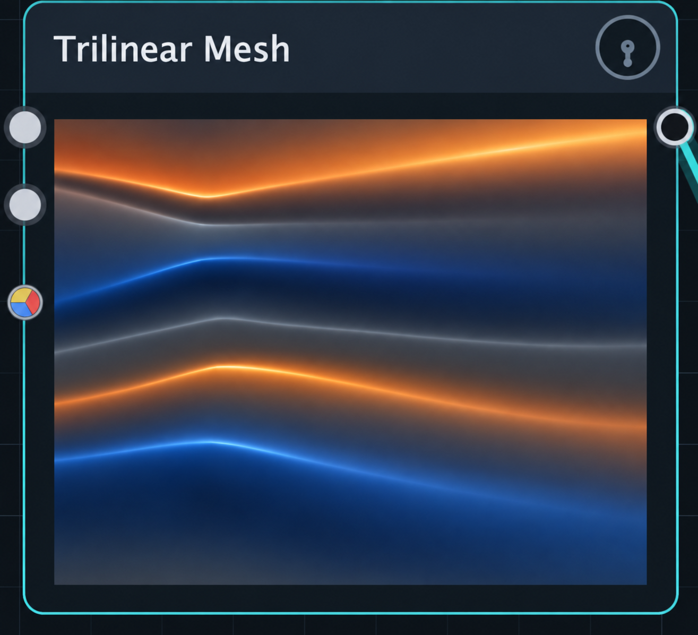
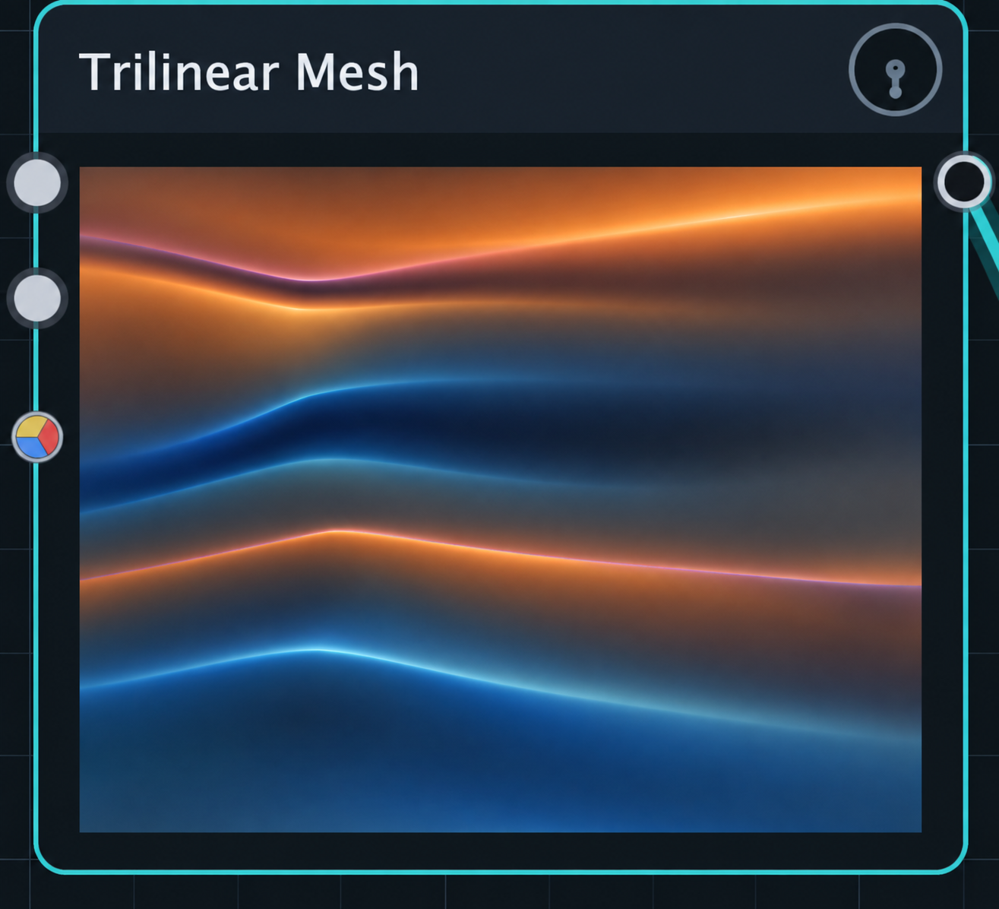

# Cycle V2 Scalar-Surface Shader

Status: Proposed

## Objective

Move live Trimesh heatmap colouring and relief shading from per-cell CPU paint
and per-column colour arrays into one shared OpenGL scalar-surface renderer.
The renderer receives the authoritative prepared scalar grid and applies
semantic colour, smooth pseudo-surface lighting, and derivative-gated detail on
the GPU. It must not evaluate curves, rasterize a mesh, or invent signal detail.

The initial product is the orthographic top-down heatmap used by compact and
expanded Trimesh presentation. A navigable geometric surface may reuse the
material in a later slice, but is not a prerequisite for replacing the live
heatmap path.

## Visual References

The calm same-palette treatment is the preferred baseline. The curvature-hue
variant demonstrates a possible optional detail channel, not the default.

| Preferred amplitude and same-palette edge treatment | Optional restrained curvature-hue treatment |
| --- | --- |
|  |  |

Both mockups exaggerate node scale and selection chrome. They specify the
surface material only. Production review occurs at the real compact-node and
expanded-editor sizes.

## Current Authoritative Implementations

- `TrimeshGridRenderService` and `TrimeshRenderData` own the prepared scalar
  grid consumed by presentation. The shader must consume that result rather
  than slice or evaluate a mesh again.
- `TrimeshRenderProfile` owns domain semantics, scale policy, pitch/frequency
  remapping, and the surface/curve/slice presentation contract.
- `TrimeshSurfaceRenderer` is the current CPU reference and headless/offline
  image path. It creates compact heatmaps and remains the deterministic
  fallback for contexts without the required OpenGL capability.
- `Panel3D` currently maps scalar values to CPU colours, and
  `GLPanelRenderer::drawSurfaceColumn` submits those colours and 2D vertices as
  fixed-function quad strips. Cycle V2's expanded Trimesh editor reaches this
  mature panel implementation through the existing shared panel host.
- `NodeCanvas` owns the Cycle V2 OpenGL context lifecycle.

No new implementation may duplicate curve evaluation, Trimesh slicing,
frequency remapping, preview normalization, or editor interaction.

## Semantic Material Contract

### Signed amplitude

For bipolar time-domain surfaces, value is the semantic truth:

- the negative extreme maps to deep navy/ultramarine;
- zero maps to a low-chroma charcoal, not teal, purple, or orange;
- the positive extreme maps to burnt orange/amber;
- colour moves monotonically through the negative, neutral, and positive
  branches; and
- increasing absolute magnitude may increase saturation and value, but must
  not move the zero boundary.

The shader receives display-normalized values after the authoritative profile
mapping. For a bipolar profile, `0.5` is exactly neutral. Lighting and detail
may modulate the resulting colour within bounded limits but may not reclassify
its sign.

Unipolar magnitude and bipolar phase profiles retain their existing domain
semantics. This work does not force the time-domain palette onto every signal
domain.

### Relief

The fragment shader samples immediate horizontal and vertical neighbours from
the scalar texture. Central differences form a pseudo-normal for restrained
diffuse and specular response. A second derivative or equivalent local
curvature measure identifies ridges, valleys, and IR-modelled ripples.

- Flat regions receive no derivative accent.
- A constant planar ramp may receive smooth directional lighting but no
  curvature seam.
- A localized ridge or valley may receive a narrow accent whose width is
  bounded in display pixels and whose strength falls quickly below threshold.
- The default accent stays inside the signed-amplitude palette: negative
  detail becomes slightly brighter or more saturated blue, and positive detail
  becomes slightly brighter or more saturated amber. Near-zero detail may use
  a fine neutral silver highlight.
- A later optional material may use low-opacity cyan/violet seams for opposite
  curvature signs. It must remain subordinate to the amplitude palette and
  must not tint broad regions.

The material must remain smooth and high-resolution. It must not add noise,
grain, micro-ripples, polygon facets, displaced geometry, or terrain texture.

## Rendering Boundary

Introduce a narrowly owned scalar-surface rendering operation beneath the
panel and Cycle V2 presentation layers. The intended data flow is:

```text
Trimesh render service
    -> profile-owned display transform
    -> immutable scalar grid snapshot
    -> cached single-channel GL texture
    -> full-rectangle fragment shader
```

The live top-down view draws one rectangle. Grid dimensions, texel size,
palette anchors, opacity, derivative thresholds, relief gain, light direction,
and specular strength are explicit shader inputs. Material policy must be a
typed C++ value produced from `TrimeshRenderProfile`, not duplicated constants
spread between widgets and GLSL source.

Prefer a floating-point single-channel texture when the active context
supports it. Capability detection and any packed fallback belong inside the GL
renderer. A missing shader or texture capability selects the CPU reference
renderer; it must not produce an empty surface or a different domain mapping.

The scalar texture cache key includes scalar-product identity or revision,
dimensions, and any profile transformation that changes uploaded samples.
Palette and lighting-only changes update uniforms without uploading the grid.
Context creation, shader compilation, texture creation, and deletion occur on
the owning GL thread.

## CPU Reference And Snapshot Policy

Keep one CPU material evaluator for semantic tests, headless automation,
embedded preset previews, and a capability fallback. Refactor
`TrimeshSurfaceRenderer` to use that evaluator rather than preserve a second
unrelated palette formula.

Do not read pixels back from the GPU for ordinary compact rendering. Compact
nodes should either draw through the canvas OpenGL pass into their declared
bounds or consume a cached presentation snapshot produced only when the scalar
product changes. The selected route must preserve node overlap and clipping and
must not create one OpenGL context per node.

## Complexity And Lifecycle Contract

For a grid with `C * R` scalar samples:

- a changed scalar product performs one `O(C * R)` upload;
- an unchanged frame performs no grid mapping, allocation, upload, or CPU
  per-cell/per-column colour generation;
- drawing is one bounded GPU surface draw plus an optional grid overlay;
- palette or lighting changes are `O(1)` CPU work plus a redraw;
- resizing changes the viewport and uniforms, not the scalar product; and
- no shader, texture, or presentation operation runs on the audio thread.

Live movement may regenerate only the surface product required by that edit.
It must not copy a `NodeGraph`, deep-copy an unrelated mesh, serialize state,
or prepare durable audio resources.

## Shared 3D Material Follow-up

A later perspectival editor may submit an indexed grid with amplitude as the
geometric height and use actual or grid-derived normals. It should reuse the
same profile-produced palette anchors and material controls. The 3D editor must
not fork the signed-amplitude mapping or become the implementation behind the
top-down view.

The mature Cycle 1 `Interactor3D` and panel interaction are the authoritative
starting points for orbit, projection, selection, and slicing. Before porting,
document pointer-down, movement, and commit costs and preserve their asymptotic
behavior.

## Implementation Slices

1. Extract a typed surface-material description and CPU reference evaluator
   from the existing profile/renderer without changing output.
2. Add the shared scalar texture, shader program, capability fallback, and GL
   lifecycle beneath the panel renderer. Migrate the expanded top-down surface
   while preserving the existing mesh and interaction path.
3. Add derivative relief and the signed time-domain palette behind explicit
   material parameters. Keep the same-palette accent as the default.
4. Integrate compact Trimesh surfaces with the single canvas GL context or a
   revision-keyed snapshot cache; delete the superseded live CPU colour path.
5. Consider the navigable 3D surface as a separate interaction TDD after the
   2D semantic material and performance contracts pass.

## Tests And Visual Proof

- Exact anchor tests cover negative extreme, zero, and positive extreme.
- Dense samples on each side of zero prove monotonic signed colour mapping and
  prove that zero remains low-chroma.
- Synthetic flat, planar-ramp, ridge, valley, and low-amplitude-ripple grids
  verify derivative classification without relying on a screenshot alone.
- A flat grid has zero edge-mask coverage. A planar ramp has zero curvature
  accent. Localized features do not recolour unrelated flat samples.
- CPU reference and GPU readback agree within an explicit per-channel tolerance
  for every domain profile and representative derivative fixture.
- Upload/allocation counters prove that repeated unchanged frames perform no
  scalar upload or CPU colour conversion.
- Context destruction and recreation rebuild resources without stale handles,
  crashes, or a blank first frame.
- A forced capability failure produces the CPU fallback with the same semantic
  palette.
- Production-size captures cover a compact node, the expanded top-down editor,
  a high-DPI scale, and a resize. Review the neutral boundary, subtle IR detail,
  clipping, and absence of invented texture.

## Architecture Review And Deletion Targets

Before implementation, record baseline sizes for `Panel3D.cpp`,
`GLPanelRenderer.cpp`, `TrimeshSurfaceRenderer.cpp`, `TrimeshWidget.cpp`, and
the selected canvas integration files. Run the Cycle V2 architecture audit and
name the single owner of material policy, GL resource lifetime, cache
invalidation, and CPU fallback.

Completion requires:

- no second mesh rasterizer or curve evaluator;
- no widget-specific shader fork;
- no per-frame CPU conversion of an unchanged live scalar grid into RGB cells
  or colour arrays;
- deletion of the superseded live top-down colour-array/per-cell path after all
  callers use the scalar renderer or documented fallback; and
- retention of the CPU reference only for headless/offline output and genuine
  capability fallback.
