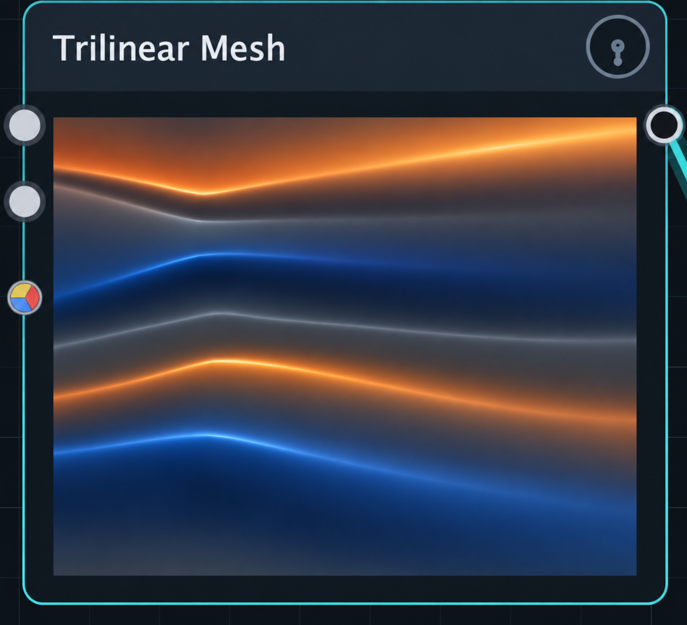
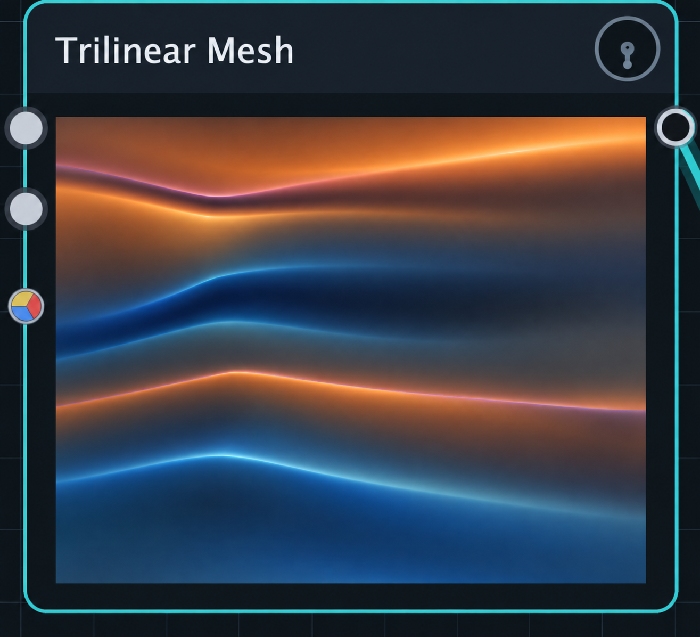

# Cycle V2 Scalar-Surface Shader

Status: Implemented

## Same-signal corrective comparison (2026-09-28, implemented candidate)

User rejected the last iterations as moving farther from the reference.
Acceptance now requires Stengah, B0, Spy 1 (impulseResponse.time), not the
old Stengah graph's different probes or a generic sine fixture. Use the
authoritative GraphPresentationModel.captureProbePreview and
NodePreviewRenderer.createRuntimeHeatmapImage boundaries, preserving their
pitch, normalization, and scalar mapping unchanged. A manual reference test
writes the actual rendered fixture; do not copy DSP or display preprocessing.
Compare the current render, earlier copper/ice and candidates before changing
the shipped material. Synthetic tests remain safety checks, not visual proof.

Matching capture established: MIDI 35 (B0 in Cycle), resolution from
SignalProbeDetailView::resolutionForMidiNote at 44.1 kHz, rather than a fixed
256/512 sample capture. The returned grid is downsampled by the existing probe
pipeline. This reproduces the screenshot's forks and four broad bands.

Candidate: H1-H2 band-pass detail rather than H0-H1. The existing separable
blur cache now prepares two scales for this mode; the smallest blur removes
near-grid speckling before differentiation. Medium-radius blur removes broad
form. No AO, new terrain lighting or raw-field directional slope. Material
owns the detail-scale/radius contract, shared by CPU sampling and GPU boundary
uniforms; shader reads green/blue channels of the existing RGBA texture.
One extra separable blur runs only on changed products; storage and per-frame
texture reads are unchanged. A lower-chroma navy accent replaces the pale-blue
overlay, while warmer highlights use a cream tint. Base remains value-only.
Colour-only, spectral, Spy normalization, and authored amplitude are unchanged.

Compared the matching pre-change capture `/private/tmp/stengah-exact/` with
bandpass, darker-copper, and reduced-blue-accent candidates; selected
`/private/tmp/stengah-bandpass-gold/stengah-b0-spy1-presented.png`.
The concentrated gold accents and suppressed blue speckle are visible in this
same-signal comparison. This is not a claim of synthetic-target parity or user
acceptance. Earlier copper/ice screenshots remain the visual baseline; unlike
the rejected iterations, the new fixture matches the user's folds and framing.
The manual `[surface-reference]` case writes both the native and presentation
PNG plus raw probe samples (little-endian columns/rows int32 then float32 in
column-major order) when CYCLE_SURFACE_REFERENCE_DIR is set. It delegates
display preprocessing unchanged and asserts source samples remain unchanged.

Verification: Cycle 1 and V2 builds pass; 19 material cases pass 1,497
assertions. All ten GPU lifecycle commands pass, with maximum CPU/GPU channel
error 2 before and after context recreation. The bandpass retains midband
response while reducing near-grid gradient energy to about 1% of the old
high-pass fixture. Existing Curve.cpp:56/57 assertions remain tracked in
ui-bugs.md. Native desktop capture remains unavailable due macOS Accessibility;
the same-signal images use the production CPU renderer, with GPU parity proven
separately. Clang-tidy is unavailable.

Refactor/style review: evaluator 963 -> 976 lines, GPU renderer 867 -> 870,
uniform binding 136 -> 131, material header 190 -> 192. Material still owns
appearance and sampling scale policy; CPU evaluator owns cached preprocessing;
renderer owns GL lifecycle. Removed the uniform layer's duplicated blur-radius
calculation. No graph/client branches or new adapter; architecture audit remains
20 existing V2 size triggers. No new scalar standard-math calls in hot paths.

## Copper/Ice detail separation (2026-09-27, implemented)

The production comparison still shows broad plastic-looking illuminated faces.
Replace full-field directional slope in the illustrative shaded mode with the
existing H0-H1 high-pass gradient. Reuse cached light blur, boundary fade, soft
saturation, linear RGB transfers, and semantic edge colours. No new blur,
texture, app-specific shader, lifecycle owner, or signal normalization.
The base palette carries broad form; deepen navy and strengthen copper/orange
before a pale yellow endpoint. Continuously energy-gated ice/gold detail may
brighten genuine ripples, never a broad plane. No threshold masks or white film.
Existing material owns all constants; CPU evaluator and GPU implement the same
contract. Per-product O(pixels) preparation and cached presentation are unchanged.
Delete broad-slope shading, retain all other view options. Verify plain ramps,
smooth sine versus ripple response, boundaries, resolution, CPU/GPU parity and
the production cyclogram before assessing the visual match.

Verification: both apps build; 18 material cases pass. At 512/1024 columns,
the maximum shading delta is 0/0 for ramps and broad sines, versus 36/31
8-bit channel levels for sine-plus-ripple. Resolution strength is bounded by
eight channel levels. Constant-field boundaries and gradual directional
response remain covered. GPU parity passes with maximum channel error 2,
including context recreation; all ten lifecycle commands pass. Existing
Curve.cpp:56/57 assertions remain the previously recorded issue.

Visual review used `/private/tmp/copper-detail-fixtures.png` and actual-size
expanded stengah Spies 4 and 5 (`/private/tmp/copper-detail-cyclogram.png`,
`/private/tmp/copper-detail-production.png`). Broad grey lighting is removed;
colour is more saturated, and fine structure receives localized ice/gold
accents. The fixture differs from the user's exact displayed signal, so this
is an approximation, not a claim of reference-image parity. No procedural
texture, spatial recolouring, or synthetic structure was added.

Refactor/style review: evaluator 959 -> 963 lines; renderer 865 -> 867.
These remain cohesive reference/material and GPU resource/render owners;
no new node, lifecycle, cache, or graph policy sites. The replaced full-slope
path is deleted, not retained alongside detail shading. Audit remains 20
existing V2 size triggers. No new scalar standard-math in production hot
loops; clang-tidy is unavailable. Other palettes and mode indices are unchanged.

## Copper/Ice revision (2026-09-26)

The shaded mode's pearl blend produced a grey film over zero crossings. Replace
that blend with hue-preserving linear-light exposure: a smoothly compressed
directional response, cubed on the facing side to restrict bright coverage,
and softer opposing shade. Cap exposure uniformly across RGB before any channel
clips. Reuse the existing H0/H1 preparation, boundary correction, and cache.
Use a sequential navy/steel/copper/apricot base with a steel-blue zero rather
than a plum luminance trench. This is an illustrative copper/ice treatment;
the other bipolar palettes remain direct references. No new material mode or
saved preference value is needed. This supersedes the pearl blending and
diverging-lightness palette described in the original shaded-mode section below.

Implementation and automated verification complete: both applications build;
17 material cases pass 1,490 assertions. The palette test allows one 8-bit
code of rounding error against the running maximum brightness, not cumulative
downward drift. All ten V2 lifecycle commands pass; GPU parity has maximum
channel error 2 before and after context recreation. Visually inspected
`/private/tmp/copper-ice-fixtures.png` (base/shaded/old-detail columns;
ramp/sine/ripple rows). Production cyclogram comparison remains pending: the
desktop capture did not capture the application. Existing Curve assertions
remain tracked in `ui-bugs.md`; clang-tidy is unavailable.

Refactor/style review: material evaluator 958 -> 959 lines, GPU renderer
866 -> 865. They retain CPU material/preprocessing and GPU resource/render
responsibilities respectively, collaborating through the shared material and
upload contracts. No new lifecycle, node, invalidation, or domain decisions;
no new scalar standard-math calls in hot paths. The architecture audit remains
at 20 existing size triggers across 516 V2 files. Existing cached work and
per-pixel complexity are unchanged; the old pearl blend is deleted for this mode.

## Bipolar Shaded (2026-09-26, implemented)

Add an opt-in illustrative material using the authoritative signed palette
contract, cached H0/H1 blur, aspect-correct gradients, and shared CPU/GPU
renderer. Append preference index 4. Existing menus delegate selection through
their existing invalidation boundary. No graph or audio state changes.

Use a quieter palette with lightness increasing away from neutral on either
side. Project H1 slope plus a restrained H0-H1 slope onto the light direction;
compress the signed response continuously, shade opposing slopes softly, and
blend facing slopes toward a continuous cool/neutral/warm pearl tint in linear
RGB. A constant field contributes zero lighting. Reuse boundary stabilization;
no AO, terrain stack, procedural texture, or thresholded edge mask. Work stays
linear in changed grid size and cached across frames; no new lifecycle owner.

Completed: both menus, saved-index compatibility, CPU/GPU parity, smooth and
rippled fixture checks, and visual inspection. The material/evaluator remains
the policy owner and the GL renderer remains the context/resource owner; the
existing large cohesive files gain only this material branch, not node policy.

At boundaries, smoothly return to the original one-sided slope as blur support
becomes asymmetric; a plane retains the same lighting at its boundary and
interior. Height-texture identity now includes relief mode and blur radii so
switching out of Colour Only cannot reuse an unblurred H1. Lighting strength
changes still require no upload. No source scalar or DSP product is modified.

Validation: Cycle 1 and Cycle V2 built; 976 assertions in 16 material cases
passed with the optional reference image enabled. The enlarged 17x17 GPU
fixture exercises interior shading and passes all seven materials with maximum
channel error 2 in both applications and after V2 context recreation. All ten
V2 lifecycle commands and four V1 fixture commands passed. Native V2 menu
selection was checked and the expanded Signal Spy inspected at production size.
Artifacts: `/private/tmp/bipolar-shaded-fixtures.png` (columns: new base,
new shaded, old bipolar detail; rows: ramp, sine, sine plus ripple),
`/private/tmp/bipolar-shaded-v2-selected.png`, and
`/private/tmp/bipolar-shaded-lifecycle.log`. Startup CoreMIDI,
`FileManager.cpp:174`, and `Curve.cpp:56/57` assertions were the existing issues
already recorded in `ui-bugs.md`. Clang-tidy was unavailable.

Architecture review: material evaluator 899 -> 958 lines; GL renderer
836 -> 866; V2 Main 541 -> 561. Material policy remains below menus and domain
profiles; upload invalidation stays in ScalarSurfaceUploadState. The larger
files remain cohesive around CPU reference/preprocessing and GPU rendering,
respectively. No rasterizer, interaction, graph, or lifecycle policy was copied.

## Flat Bipolar Mode (2026-09-26)

Cycle 1 and Cycle V2 expose `Bipolar (Colour Only)` as a fourth time-surface
choice. It reuses the exact nine-stop bipolar palette from `signedAmplitude()`
but selects the shared `None` relief path, making the displayed pixel a direct
function of scalar value and opacity. No derivative, emboss, edge tint,
specular, shadow, or cavity term is evaluated. The previous `Bipolar` entry is
retained as `Bipolar + Detail` and keeps its persisted value `0`; the new flat
style is appended as value `3`, preserving all prior saved preferences.

The post-change review sizes are 541 lines for Cycle V2 `Main.cpp`, 899 lines
for `ScalarSurfaceMaterial.cpp`, and 836 lines for
`GLScalarSurfaceRenderer.cpp`. Their responsibilities remain unchanged: menu
command routing, CPU material/reference policy, and GPU resource/render policy,
respectively. The slice adds no graph or node policy and no second renderer.

Verification built Cycle 1, Cycle V2, `AmaranthLib_tests`, and `CycleV2_tests`.
The surface-material suite passed 750 assertions in 14 cases; the focused
Trimesh profile and Signal Spy normalization cases passed 52 and 4 assertions.
All ten lifecycle commands and context recreation passed. CPU/GPU parity,
including both flat materials, passed before and after recreation with a
maximum channel error of 2. Only the pre-existing `Curve.cpp:56/57` assertions
already tracked in `docs/TDD/ui-bugs.md` remained in the final run.

## Pure Cycle 1 Blue Mode (2026-09-25)

Cycle 1 and Cycle V2 expose a third `Blue Depth` time-surface option alongside
`Bipolar` and `Blue Depth + Directional Detail`. `Blue Depth` uses the original
Cycle 1 `Gradients::blue_png` lookup table exactly; it is not an approximation
made from the newer hand-authored blue stops. Its material relief mode is
explicitly `None`, so CPU fallback and GPU output contain no emboss,
directional tint, cavity, shadow, exposure, pearl, or specular contribution.

The GPU packs the legacy magnitude and blue lookup tables into separate rows of
one palette texture. The CPU evaluator samples the same 512-entry source asset,
and parity validation covers the pure blue material. Existing persisted enum
indices remain unchanged (`Bipolar = 0`, directional detail `= 1`); pure blue is
the new value `2`.

The post-change files remain cohesive despite their review-trigger sizes:
`ScalarSurfaceMaterial.cpp` is 885 lines and remains the single CPU material,
palette, preprocessing, and reference-evaluation owner;
`GLScalarSurfaceRenderer.cpp` is 834 lines and remains the single GPU program,
texture, parity, and GL-lifecycle owner. `cycle-v2/src/Main.cpp` is 521 lines;
its additions are only command/menu orchestration. No graph, node, rasterizer,
or domain lifecycle policy moved into these files, and no equivalent Cycle V2
policy site was introduced.

Verification on 2026-09-25 built `AmaranthLib_tests`, Cycle 1, Cycle V2, and
`CycleV2_tests`. The surface-material suite passed 733 assertions in 13 cases;
the focused Trimesh profile and Signal Spy normalization cases passed 52 and 4
assertions. All ten scalar-surface lifecycle automation commands passed across
OpenGL context recreation, and CPU/GPU parity passed before and after recreation
with a maximum channel error of 2. The run also emitted the pre-existing
`Curve.cpp:56/57` assertions already tracked in `docs/TDD/ui-bugs.md`.

## Implementation Record

### Baseline (2026-09-20)

| File | Lines before work | Existing responsibility relevant to this change |
| --- | ---: | --- |
| `lib/src/UI/Panels/Panel3D.cpp` | 1,031 | Panel orchestration plus per-column value-to-colour conversion and quad-strip geometry |
| `lib/src/UI/Panels/GLPanelRenderer.cpp` | 209 | Shared fixed-function GL submission for Cycle 1 and Cycle V2 panels |
| `cycle-v2/src/Nodes/Trimesh/Rendering/TrimeshSurfaceRenderer.cpp` | 106 | Deterministic CPU heatmap and compact/headless path |
| `cycle-v2/src/Nodes/Trimesh/Editor/TrimeshWidget.cpp` | 830 | Trimesh editor composition and routing |
| `cycle-v2/src/UI/NodeCanvas.cpp` | 2,702 | Canvas lifecycle and high-level orchestration |
| `cycle-v2/src/Nodes/Trimesh/Panel/TrimeshPanelHosts.cpp` | 270 | Shared-canvas panel GL setup and rendering |
| `cycle-v2/src/Nodes/Trimesh/Panel/TrimeshPanel3D.cpp` | 163 | Cycle V2 domain/profile adaptation to the mature panel |

The pre-change architecture audit reported the existing Cycle V2 size triggers,
including plan-level triggers for `NodeCanvas.cpp` and review-level triggers for
`TrimeshWidget.cpp`. Neither file is an implementation target for the shared
renderer slice.

### Technical Design

- The mature `Panel3D` grid and interaction path remains authoritative. This
  change reuses its prepared columns, zoom mapping, clipping, surface-cache
  bake lifecycle, and overlay ordering unchanged; it does not evaluate a curve
  or rasterize a mesh.
- A shared scalar-surface material/evaluator below both products owns palette,
  relief, and derivative classification. `TrimeshRenderProfile` translates
  domain semantics into that material; Cycle 1 panels select the equivalent
  material directly at their existing domain boundary.
- A dedicated GL scalar-surface collaborator owned by `GLPanelRenderer` owns
  shader, texture, upload cache, capability detection, and GL-thread cleanup.
  `GLPanelRenderer` remains routing glue rather than absorbing shader policy.
- `Panel3D` submits an immutable column-major scalar-grid view and the exact
  scaled rectangle. A successful shader draw replaces only the old per-column
  colour conversion and quad-strip submission. Failure returns to the existing
  CPU/fixed-function path with the same prepared values and interaction.
- Grid upload identity consists of the source identity/revision, dimensions,
  and value transform. Material-only updates are uniforms. Context recreation
  clears GL handles and forces the next successful draw to upload once.
- The steady-state cost is one cached surface texture draw. A changed product
  performs one `O(columns * rows)` upload. Neither draw path scans the graph,
  mesh, audio resources, or unrelated panel state.

### Ownership And Deletion Targets

- Material policy: shared scalar-surface material plus the profile/domain
  adapter that constructs it.
- GL resource lifetime and upload invalidation: the GL scalar-surface
  collaborator owned by `GLPanelRenderer`.
- CPU fallback: the shared CPU material evaluator, called by
  `TrimeshSurfaceRenderer` and by the retained capability fallback.
- Delete the live `Panel3D` colour-array path once every panel domain is backed
  by the typed material and forced-capability fallback. Until then it is the
  documented fallback and remains isolated behind a failed scalar draw.
- Stable end state: one material contract and evaluator, one shared GL
  renderer, no widget-owned shaders, and no duplicated curve/grid evaluation.

### Implemented Slice (2026-09-20)

- Cycle 1 was migrated first. `Waveform3D` now selects the shared signed
  material, and `Panel3D` submits its authoritative prepared scalar columns to
  the shared renderer. Its retained fixed-function fallback uses a gradient
  generated from the same material contract.
- `GLScalarSurfaceRenderer`, owned by `GLPanelRenderer`, uploads one
  single-channel floating-point texture and shades one rectangle. It owns
  program/texture creation and destruction, stable-product upload
  invalidation, uniforms, and the forced-capability fallback boundary.
- Cycle V2 adapts `TrimeshRenderProfile` to the shared typed material and gives
  expanded panels a stable scalar-product revision. Spectral pitch-column
  mapping remains profile-owned and is performed before the renderer
  boundary.
- Compact and headless rendering use a revision-keyed CPU image made by the
  shared evaluator. The former live per-cell `Graphics` fill loop and the
  profile-local gradient formula were deleted.
- Expanded products use a fixed 768 by 320 grid. Resizing changes presentation
  bounds without changing the product resolution or scalar texture cache key.
- Shader capability can be disabled with
  `CYCLE_DISABLE_SCALAR_SURFACE_SHADER`; the existing panel fallback then
  renders the same domain palette instead of producing an empty surface.

### Post-Implementation Architecture Review

| File | Lines after work | Review result |
| --- | ---: | --- |
| `lib/src/UI/Panels/Panel3D.cpp` | 1,069 | Remains panel orchestration; 38 lines adapt the locked authoritative grid to an immutable render view. Material and GL policy stay outside. |
| `lib/src/UI/Panels/GLPanelRenderer.cpp` | 218 | Nine routing/lifecycle lines; shader policy is delegated to the dedicated collaborator. |
| `lib/src/UI/Panels/GLScalarSurfaceRenderer.cpp` | 562 | Cohesive GL resource, upload-cache, uniform, draw, and opt-in parity-validation owner. |
| `lib/src/UI/Panels/ScalarSurfaceMaterial.cpp` | 198 | Single palette, derivative, and CPU-reference policy owner. |
| `cycle-v2/src/Nodes/Trimesh/Rendering/TrimeshSurfaceRenderer.cpp` | 90 | Reduced by 16 lines and now delegates colour/relief policy. |
| `cycle-v2/src/Nodes/Trimesh/Editor/TrimeshWidget.cpp` | 830 | No growth; its existing composition role only selects the fixed expanded product resolution. |
| `cycle-v2/src/UI/NodeCanvas.cpp` | 2,714 | Remains the shared-context lifecycle owner; context counters and the narrow automation recreate hook sit beside the existing attach/detach callbacks. |
| `cycle-v2/src/Nodes/Trimesh/Panel/TrimeshPanelHosts.cpp` | 276 | Six lifecycle lines release renderer resources while the shared context is current. |
| `cycle-v2/src/Nodes/Trimesh/Panel/TrimeshPanel3D.cpp` | 168 | Five adapter lines translate profile semantics to the shared material. |

The after-change architecture audit reports the same 20 pre-existing size
triggers and no new trigger. `TrimeshWidget.cpp` remains a review-level file,
but this slice adds no lines or policy to it. `NodeCanvas.cpp` was already a
plan-level file and grew by 12 lines for lifecycle counters and an automation
entry point. Those members are cohesive with its existing ownership of the
shared `OpenGLContext`; extracting them would split the attach/detach lifecycle
across owners. Material selection has one profile/domain decision site, GL
resource and cache policy has one renderer owner, and callers provide only
scalar data, bounds, revision, and material facts. No graph, mesh, curve, or
DSP behavior was copied.
`CycleV2Automation.cpp` remains a review-level command router at 891 lines; its
seven added lines only dispatch the context-recreation command to the existing
workspace/canvas owner and introduce no rendering or lifecycle policy.

### Verification Record

- `AmaranthLib_tests '[surface-material]'`: 87 assertions in four cases cover
  exact anchors, signed monotonicity, flat/plane/ridge/valley derivatives,
  sub-threshold ripple rejection, and upload-cache invalidation.
- Focused Cycle V2 surface, spectral RGBA parity, orientation, resize,
  magnitude-scale, and phase-mapping tests: 101 assertions across six cases.
- Automation registry and OpenGL lifecycle diagnostics: 19 assertions across
  two cases.
- Standalone Debug `Cycle` and `CycleV2` builds completed with
  `--parallel 10`.
- Production fixtures passed for Cycle 1, Cycle V2 compact, Cycle V2 expanded,
  and forced shader disable. The expanded report records a 768 by 320 product;
  the Cycle 1 diagnostics report `GL_NO_ERROR` at a 2.0 rendering scale.
- With `CYCLE_VALIDATE_SCALAR_SURFACE_SHADER=1`, the renderer draws a
  representative slope/curvature fixture for signed amplitude, unipolar
  magnitude, and bipolar phase into an offscreen framebuffer. GPU RGBA readback
  agrees with the CPU reference within the explicit 4/255 per-channel
  tolerance; the observed maximum error is 3/255. Ordinary rendering performs
  no readback.
- `cycle-v2-agent-scalar-surface-lifecycle.json` recreates the shared context
  in process. Diagnostics advance from create/close counts 1/0 to 2/1, the
  expanded editor remains present, and the shader parity validation passes
  both before and after recreation, proving a clean resource rebuild and draw.
- Visual artifacts: `/tmp/cycle-scalar-v1.png`,
  `/tmp/cycle-scalar-v2-compact.png`, and
  `/tmp/cycle-scalar-v2-expanded.png`. The expanded capture is 1728 by 962 and
  includes the production 733 by 399 shared-GL panel.
- `git diff --check` and the scalar-math hot-loop self-check pass. The local
  environment does not provide `clang-tidy`, so that optional check could not
  run.

### Visual And Preset-Lifecycle Correction (2026-09-20)

- The initial absolute-curvature accent emphasized the discontinuities of a
  linearly filtered scalar texture and produced paired, blotchy outlines. The
  corrected evaluator first applies the same five-tap cross smoothing on CPU
  and GPU, then uses signed curvature: ridges receive a restrained luminance
  lift and valleys receive cavity shadow. Relief no longer blends toward a
  separate accent hue.
- Spectral magnitude again samples the authoritative 512-pixel
  `burntalum_png` asset. The shader owns a static palette texture in addition
  to its single live scalar-data texture; this does not change scalar upload
  identity or steady-state graph/render cost.
- The GPU readback tolerance is explicitly 5/255 after the wider derivative
  stencil; the observed maximum error is 5/255 before and after context
  recreation.
- Cycle V2 preview resources retain only the durable document graph. A
  transient editing overlay is passed explicitly for the preview call that
  consumes it, so live guide context remains current without replacing the
  retained pointer and dangling after gesture completion.
- Cycle 1 unison visualization now sizes its scratch arena from the largest
  actual preset column. It no longer assumes all retained columns match the
  current FFT-order-derived size during preset replacement.
- Regression fixtures alternate five Cycle V2 graph loads and seven Cycle 1
  preset loads. Both completed with no new crash report. Production captures:
  `/tmp/cycle-surface-relief-v1.png`,
  `/tmp/cycle-surface-relief-v2.png`, and
  `/tmp/cycle-surface-magnitude-v2.png`.

The correction touches existing Cycle V2 size-trigger files only as narrow
orchestration adapters. `NodeCanvas` owns the current editing-graph read and
passes it to the preview boundary; `NodeCanvasPresentation` packages the graph
already present in its immutable frame; `NodePreviewRenderer` forwards that
fact without deciding lifecycle. `NodePreviewResources` remains the owner of
preview widgets, cached sprites, pitch contexts, and their graph-lifetime
boundary: its retained pointer is durable, while transient graphs are
call-scoped. `NodeCanvasEditorCoordinator` supplies the durable document graph
for its durable-node path. No second lifecycle decision site or graph copy was
introduced. The shared GL renderer is 646 lines after the correction, below
its review trigger, and remains cohesive around shader compilation, its scalar
and static palette textures, upload invalidation, draw state, cleanup, and
opt-in parity validation. The architecture audit still reports the same 20
  pre-existing size triggers.

### Pearl Palette And Relief Correction (2026-09-20)

- Signed amplitude now uses a shared nine-stop scalar palette instead of the
  original three-anchor interpolation. Deep indigo troughs rise through blue
  and periwinkle before converging narrowly on dark low-chroma plum at zero;
  positive values rise through warm rose, apricot, peach, and pale amber. The
  lookup has no coordinate, band, or region input, so equal scalar values
  always receive the same base colour.
- Signed surfaces are opaque and have material-local luminance bounds. Their
  stronger diffuse, specular, ridge, and cavity response does not alter the
  established spectral-magnitude or bipolar-phase materials. Lighting remains
  a scalar multiplier after palette lookup and therefore cannot rotate hue or
  move the zero boundary.
- The CPU evaluator owns the palette stops and uploads them as shader uniforms,
  avoiding a second hard-coded GPU palette. The shader matches the CPU
  evaluator's eight-bit palette quantization before relief modulation. GPU
  parity uses an explicit 8/255 limit for driver sampling differences at the
  smoothed texture edges; the observed maximum is 7/255 before and after
  in-process context recreation.
- Focused material tests now include 50 assertions across five cases, including
  the periwinkle negative shoulder, plum neutral, peach positive branch,
  coordinate-independent constant-scalar rendering, luminance-only relief,
  and exact preservation of the legacy burnt-alum magnitude palette.
- Production Cycle 1 review capture:
  `/tmp/cycle-surface-pearl-final-v1-clean.png`. The capture shows smooth
  directional embossing without the paired curvature outlines or stippled
  calculation-noise appearance of the earlier derivative shader.
- The seven-load Cycle 1 and five-graph Cycle 2 churn fixtures completed with
  no crash or OpenGL error. The focused Cycle 2 render-profile case passes 52
  assertions with the opaque signed material, and final GPU validation passes
  at 7/255 both before and after context recreation.

### Signal Spy Contrast Normalization (2026-09-20)

- Signal Spies previously applied their soft-sign time transform directly to
  raw audio amplitude. Ordinary levels therefore occupied only a narrow range
  around scalar zero and appeared uniformly plum and desaturated even though
  the shared material could render the full palette.
- `PreviewContrastNormalization` is the authoritative display-only peak
  normalizer. It extracts the mature normalization formerly local to
  `DefaultOutputPreview`; both default-output presentation and Signal Spy
  presentation now reuse it. Raw probe values, statistics, audio products, and
  authored Trimesh grids remain unchanged.
- Time Spies normalize to a peak of three before the existing soft-sign curve,
  placing their strongest values at 0.125 and 0.875 rather than clipping to the
  palette endpoints. Spectral-magnitude Spies normalize their visible bins to
  unity before logarithmic display mapping; DC is excluded from the peak just
  as it is excluded from the displayed logarithmic rows. Phase retains its
  existing domain normalization.
- This adds one bounded `O(columns * rows)` pass over the local render product.
  It does not traverse the graph or mutate runtime data, and Mesh Surface
  previews retain absolute authored gain. The old private default-output
  normalizer was deleted rather than copied.
- Focused `[probe][ui]` coverage includes low-level chroma, gain-invariant time
  and magnitude Spy images, above-unity detail, DC exclusion, and a negative
  assertion that Trimesh previews are not normalized. Production captures:
  `/tmp/cycle-v2-spy-compact.png` and `/tmp/cycle-v2-spy-detail.png`.

The architecture audit remains at the same 20 pre-existing triggers.
`NodePreviewRenderer.cpp` grows from 1,032 to 1,042 lines and remains the
preview-role/domain routing and painting owner; it supplies only role,
dimensions, and local values to the normalization boundary. The new 53-line
runtime helper owns peak selection and scaling, while `TrimeshRenderProfile`
continues to own domain mapping and `TrimeshSurfaceRenderer` continues to own
image generation. The former duplicate decision site in
`DefaultOutputPreview.cpp` was deleted, reducing that file to 59 lines.

### Resolution-Correct Pseudo-Normal Relief (2026-09-21)

- The shared material retains the nine signed-amplitude anchors, but their
  scalar positions are now explicit. Cool dusk and warm dusk stops flank a
  narrow charcoal zero interval. A neutral-specific luminance floor prevents
  a steep zero crossing from turning the semantic neutral into an artificial
  black contour; it does not move or recolour the sign boundary.
- The former five-tap emboss calculation was deleted. CPU and GPU evaluators
  now sample deliberate normalized radii, derive aspect-correct gradients,
  construct a three-dimensional pseudo-normal, and apply normal-based diffuse
  plus Blinn-Phong specular lighting. Broad forms therefore retain coherent
  lighting as grid resolution changes.
- Three projected-light samples provide bounded directional horizon shadow.
  Small- and large-radius curvature contribute only a restrained cavity term.
  The centre scalar remains authoritative for palette lookup; neither wider
  sample path blurs or replaces it.
- Lighting is evaluated in linear RGB. Specular blends toward sign-specific
  pearl tints, while diffuse, horizon shadow, and cavity remain luminance
  effects. The CPU transfer functions use one-time lookup tables, avoiding
  scalar power calls in the image loop. The remaining scalar square root is a
  deliberate fallback for one coupled three-component normal per output
  pixel; expressing it through `Buffer` would require several product-sized
  temporaries and would not remove the per-pixel cross-channel dependency.
- Display aspect is passed to Cycle V2 compact, expanded, and Signal Spy CPU
  images and participates in compact-image cache identity. Cycle 1 and Cycle
  V2 expanded panels continue to obtain the same fact from their shared
  `ScalarSurfaceRenderData::bounds` boundary.
- GPU uniform translation was extracted to the 127-line
  `GLScalarSurfaceUniforms.h`. `GLScalarSurfaceRenderer.cpp` is 717 lines and
  remains responsible only for shader/resource lifecycle, texture upload,
  draw submission, and parity validation. `ScalarSurfaceMaterial.cpp` is 512
  lines and remains the single CPU material/reference owner. The touched
  Cycle V2 review-trigger files grew only through aspect translation:
  `NodePreviewRenderer.cpp` is 1,052 lines and `TrimeshWidget.cpp` is 839
  lines; neither gained material or sampling policy.
- Focused material coverage now includes scalar-only palette semantics, narrow
  zero continuity, uniform flat fields, mirrored pseudo-normal response,
  view-dependent specular response, resolution-stable broad planes,
  directional horizon shadow, constant-offset invariance, and legacy spectral
  palette preservation. The opt-in offscreen GPU comparison passes at 2/255
  maximum channel error.
- Production review artifacts are
  `/private/tmp/cycle-surface-normal-final-v1.png`,
  `/private/tmp/cycle-surface-normal-v2-expanded.png`, and
  `/private/tmp/cycle-v2-spy-detail.png`. Seven-load Cycle 1 and five-graph
  Cycle V2 preset-churn fixtures completed with no failed command or new crash.
  Existing startup `FileManager.cpp:174` and Trimesh `Curve.cpp:56/57`
  assertions remain recorded in `ui-bugs.md`.

### Cached Multi-Scale Matte Relief (2026-09-22)

This slice supersedes the signed palette and single-scale relief described
above while retaining the same ownership boundaries.

- Time-domain amplitude returns to a continuous navy, blue, pale-blue, and
  white scalar ramp. It has no polarity-specific neutral stop and therefore no
  luminance trench at the bipolar centre line. Warm colour is limited to a
  weak, relief-derived highlight tint. Spectral magnitude retains the mature
  Burnt Alum mapping, and bipolar phase retains its domain palette.
- `ScalarSurfaceMaterialEvaluator` owns the authoritative cached product: H0
  plus three replicated-edge separable box blurs at small, medium, and broad
  domain-relative radii. The four fields are packed as RGBA floats. Cycle 1
  and Cycle 2 expanded views build and upload this product only when scalar
  texture identity changes; compact/headless CPU output builds the identical
  representation once per generated image.
- CPU and GPU evaluators differentiate each scale at one texel with one-sided
  boundary differences. The former wide derivative stencil and clamped
  projected horizon samples are deleted, removing the asymmetric edge support
  that produced the left bevel.
- Four normal-based diffuse hillshades blend at 15/25/35/25 percent. Fine
  detail is deliberately subordinate to medium and broad form. Valley
  obscurance derives from positive `Hn - H0 - bias`; weaker ridge exposure
  derives from `H0 - H2 - bias`. The explicit horizon-shadow and one-texel
  curvature paths are deleted.
- Lighting remains linear RGB. Medium-scale Blinn-Phong is retained only as a
  narrow 4.5-percent finishing term with a 24-power lobe; pearl tint is 16
  percent. Multi-scale matte luminance, rather than gloss, now carries shape.
- The blur pass is O(columns * rows) per scale through sliding sums. Its inner
  loops contain only indexing, addition, subtraction, and writes. Source
  transform and clamping use the repository `VecOps`/`Buffer` boundary. There
  is no reusable repository 2D image blur; the audio convolution code remains
  isolated from visualization representation and lifecycle.
- CPU fallback shading evaluates five coupled three-component normal lengths
  per pixel (four diffuse scales plus the medium-scale highlight). Scalar
  square root is retained for that cross-channel calculation because the
  repository array operations cannot express it without several additional
  product-sized gradient and normal buffers. Palette transfer powers remain
  one-time lookup-table initialization, not per-pixel work.
- Focused contracts cover a monotonic blue ramp, smooth midpoint luminance,
  uniform flat fields including boundaries, resolution-stable slopes,
  constant-offset invariance, ridge exposure, valley obscurance, legacy
  spectral colour, upload identity, and CPU/GPU parity.
- Post-change sizes are 586 lines for `ScalarSurfaceMaterial.cpp`, 732 for
  `GLScalarSurfaceRenderer.cpp`, 95 for the uniform translator, and 141 for
  the material contract header. Responsibilities remain separated: material
  policy and CPU reference, GL resource/upload/draw lifecycle, and uniform
  representation translation respectively. The Cycle V2 architecture audit
  remains at the same 20 pre-existing triggers; no triggered Cycle V2 file was
  changed by this slice.
- Production review artifacts are
  `/private/tmp/cycle-surface-matte-v1-os.png`,
  `/private/tmp/cycle-surface-matte-v2-expanded-os.png`, and
  `/private/tmp/cycle-v2-spy-detail.png`. GPU parity passes at 2/255. Seven
  Cycle 1 loads and five Cycle 2 graph loads completed without a failed
  command or crash; the existing startup, CoreMIDI, leak-detector, and Curve
  assertions remain tracked in `ui-bugs.md`.

### Fidelity-First Signed Micro-Emboss (2026-09-23)

This slice supersedes the cached terrain treatment for signed time-domain
surfaces only. Spectral magnitude and bipolar phase retain the multi-scale
material where broad relief remains useful.

- Signed amplitude again uses continuous bipolar semantics: deep indigo and
  periwinkle for negative values, a broad low-chroma plum neighbourhood at
  zero, and rose through pale amber for positive values. Smooth interpolation
  within every palette interval gives the transition a zero first derivative
  at its anchors and avoids a narrow, shader-created zero contour.
- The signed material consumes only H0 and the smallest blur H1. Its normal is
  derived from the gradient of `H0 - H1`, never from the complete height
  field. Consequently, a constant surface, linear ramp, or broad smooth sine
  does not become a sequence of illuminated terrain faces.
- Flat-light subtraction and an explicit limit bound the micro-emboss to six
  percent luminance. Signed edge colour is additionally gated by both detail
  gradient and high-pass energy, fades smoothly near neutral, and blends at no
  more than four percent toward cool periwinkle or warm peach. The signed path
  has no diffuse hillshade, obscurance, exposure, horizon shadow, specular, or
  pearl term.
- The separable blur now renormalizes its kernel using only valid samples at
  every boundary. A short support-aware fade prevents any remaining H0/H1
  mismatch from becoming an edge-localized accent. The packed RGBA product is
  retained as the shared representation, but the signed path computes only
  H1 and does not spend work generating H2 or H3.
- Focused material coverage has 148 assertions across eight cases. It checks
  bipolar hue branches, a smooth zero transition, exact constant-field colour
  through all four boundaries, rejection of broad planes, colour-dominant
  smooth sine output, weak-ripple selection, and comparable detail energy at
  512 and 1024 samples. Signal Spy normalization and authored Trimesh
  amplitude tests remain green at their existing boundary.
- GPU parity passes at 2/255 before and after in-process context recreation.
  Forced CPU fallback and the live shader produce visually equivalent expanded
  Cycle V2 surfaces. Seven Cycle 1 preset loads and five Cycle V2 graph loads
  complete without a failed command or crash.
- Review artifacts are
  `/private/tmp/cycle-surface-micro-v1-os.png`,
  `/private/tmp/cycle-surface-micro-v2-os.png`, and
  `/private/tmp/cycle-v2-spy-detail.png`; forced fallback is
  `/private/tmp/cycle-surface-micro-v2-fallback-os.png`.
- Post-change shared-file sizes are 703 lines for the CPU material/evaluator,
  782 for the GL renderer, 123 for uniform translation, and 162 for the
  material contract. They retain their existing responsibilities; no Cycle V2
  orchestration or domain file changed. The architecture audit therefore
  remains at the same 20 pre-existing triggers.

### Selectable Time-Surface Colour (2026-09-24)

- Cycle 1 and Cycle V2 now expose `View > Time Surface Colour` with two
  mutually exclusive choices: `Bipolar` retains the signed indigo/plum/amber
  treatment, while `Blue Depth + Directional Detail` uses a sequential depth
  ramp. The new blue mode is the default. Cycle 1 stores the choice in its
  existing global settings document; Cycle V2 stores it in its existing
  application properties file.
- `ScalarSurfaceMaterial` is the authoritative process-wide presentation
  preference and factory. Callers still request one time-domain material;
  neither Cycle product owns a shader or copies palette/detail policy. Integer
  persistence translation is centralized at this boundary rather than
  repeated in menu and canvas code.
- The blue base progresses from near-black navy through low-chroma slate at
  scalar `0.5` to ice white. A 512-sample contract proves nondecreasing
  perceived luminance, limits the largest adjacent step to less than two
  percent, and keeps midpoint saturation below twenty percent. A perfect
  constant, ramp, or other H0/H1-low-pass form therefore remains a smooth blue
  depth field.
- Accent colour is not part of the base palette. High-pass energy controls
  blend strength, while the undirected local-gradient angle selects a smooth
  magenta/cyan/yellow tint. The result blends at no more than ten percent in
  linear RGB. Unlike the bipolar material, this sequential mode does not
  suppress detail colour near scalar `0.5`; depth has no polarity boundary to
  protect.
- Cycle V2 compact and runtime heatmap cache signatures include the selected
  style only for non-spectral domains. Changing the option rebuilds affected
  time products while spectral magnitude/phase sprites retain their cache
  identity. Expanded OpenGL presentation receives a repaint and resolves the
  material through the same dynamic factory.
- GPU validation now covers both time styles plus magnitude and phase and
  passes at 2/255 maximum channel error. The same tolerance holds before and
  after forced OpenGL context recreation, with all ten lifecycle automation
  commands succeeding. The same lifecycle fixture also passes all ten commands
  with the scalar-surface shader explicitly disabled, covering the CPU
  fallback. Focused material coverage has 699 assertions across ten cases; the
  Cycle V2 profile and Signal Spy contrast contracts also pass. Production
  artifacts are
  `/private/tmp/cycle-blue-warm-v1.png`,
  `/private/tmp/cycle-blue-warm-v2.png`, and
  `/private/tmp/cycle-v2-spy-detail.png`.

The architecture audit remains at the same 20 pre-existing triggers.
`NodeCanvas.cpp` grows from 2,716 to 2,731 lines solely at its existing global
settings, preview-cache, component repaint, and OpenGL repaint lifecycle
boundary. `NodePreviewRenderer.cpp` grows from 1,052 to 1,067 lines to include
material choice in its existing cache-key policy; it does not choose the
material. `Main.cpp` remains menu/application orchestration at 501 lines.
Shared `ScalarSurfaceMaterial.cpp` and `GLScalarSurfaceRenderer.cpp` are 833
and 814 lines respectively, crossing the review threshold but remaining
cohesive: the former owns palette/detail policy, cached field preparation, and
the CPU reference; the latter owns only shader/resource/upload/draw/parity
lifecycle. Neither reaches the extraction-plan threshold, and no graph, DSP,
or interaction policy moved into them.

### Continuous High-Pass Accent (2026-09-24)

- Production feedback showed that multiplying separate gradient and energy
  `smoothstep` gates made the detail accent behave like a thresholded mask.
  Most visible samples clustered at the first dark-burgundy palette stop, then
  appeared over a narrow interval with little hue variation.
- Both CPU and GPU implementations now use zero-origin saturating response
  curves, `x / (x + knee)`, for high-pass energy and gradient energy. There is
  no lower cutoff. High-pass energy continuously controls both tint amount and
  palette position; the gradient response only provides a smooth secondary
  weight and never suppresses low-energy detail completely.
- The tint LUT now begins at rose rather than dark burgundy and progresses
  through red and coral to amber. Since zero energy produces zero blend, a dark
  first stop is unnecessary and only muddies weak detail.
- A focused contract proves that sub-threshold energy from the former model is
  visible, that red and green channels progress with energy, and that crossing
  the former cutoff changes no channel by more than 1/255. Material coverage is
  now 704 assertions across eleven cases. GPU parity remains within 2/255
  before and after OpenGL context recreation.
- The intermediate captures were `/private/tmp/cycle-v2-spy-detail.png` and
  `/private/tmp/cycle-v1-smooth-detail.png`. Broad forms remained governed by
  the monotonic blue depth palette while fine structure varied continuously
  from a faint rose accent toward coral/amber.

### Directional CMY Detail (2026-09-25)

- The intermediate rose/red/coral/amber energy palette is superseded. Detail
  hue now encodes local high-pass orientation: the three principal undirected
  axes map to magenta, cyan, and yellow, with continuous mixtures between them.
- Orientation is sign-invariant. Reversing the gradient produces the same
  colour, so opposite flanks of one ridge do not receive unrelated hues. The
  mapping uses normalized fourth-power projection weights rather than angle
  thresholds or `atan`, avoiding seams and scalar trigonometry in the pixel
  loop.
- High-pass energy still controls accent amount through the continuous
  zero-origin response. Gradient energy also fades the directional colour to
  zero where an angle is undefined. The monotonic blue depth palette remains
  authoritative and spectral materials remain unchanged.
- The View-menu label is now `Blue Depth + Directional Detail` in both Cycle
  versions. Its persisted enum index is unchanged, so existing preferences
  continue selecting the same mode.
- Focused material coverage has 713 assertions across twelve cases, including
  CMY principal-axis semantics and invariance under gradient reversal. The
  production artifacts are `/private/tmp/cycle-v2-spy-detail.png` and
  `/private/tmp/cycle-v1-cmy-detail.png`. GPU parity remains within 2/255 before
  and after context recreation.

## Objective

Move live Trimesh heatmap colouring and relief shading from per-cell CPU paint
and per-column colour arrays into one shared OpenGL scalar-surface renderer.
The renderer receives the authoritative prepared scalar grid and applies
semantic colour, smooth pseudo-surface lighting, and derivative-gated detail on
the GPU. It must not evaluate curves, rasterize a mesh, or invent signal detail.

The initial product is the orthographic top-down heatmap used by compact and
expanded Trimesh presentation. A navigable geometric surface may reuse the
material in a later slice, but is not a prerequisite for replacing the live
heatmap path.

## Visual References

The calm same-palette treatment is the preferred baseline. The curvature-hue
variant demonstrates a possible optional detail channel, not the default.

| Preferred amplitude and same-palette edge treatment | Optional restrained curvature-hue treatment |
| --- | --- |
|  |  |

Both mockups exaggerate node scale and selection chrome. They specify the
surface material only. Production review occurs at the real compact-node and
expanded-editor sizes.

## Current Authoritative Implementations

- `TrimeshGridRenderService` and `TrimeshRenderData` own the prepared scalar
  grid consumed by presentation. The shader must consume that result rather
  than slice or evaluate a mesh again.
- `TrimeshRenderProfile` owns domain semantics, scale policy, pitch/frequency
  remapping, and the surface/curve/slice presentation contract.
- `TrimeshSurfaceRenderer` is the current CPU reference and headless/offline
  image path. It creates compact heatmaps and remains the deterministic
  fallback for contexts without the required OpenGL capability.
- `Panel3D` currently maps scalar values to CPU colours, and
  `GLPanelRenderer::drawSurfaceColumn` submits those colours and 2D vertices as
  fixed-function quad strips. Cycle V2's expanded Trimesh editor reaches this
  mature panel implementation through the existing shared panel host.
- `NodeCanvas` owns the Cycle V2 OpenGL context lifecycle.

No new implementation may duplicate curve evaluation, Trimesh slicing,
frequency remapping, preview normalization, or editor interaction.

## Semantic Material Contract

### Signed amplitude

For bipolar time-domain surfaces, value is the semantic truth:

- the negative extreme maps to deep navy/ultramarine;
- values approaching zero from below may pass through a brighter periwinkle
  shoulder before converging on the neutral boundary;
- zero maps to low-chroma charcoal or dark plum, never teal or orange;
- the positive branch passes through warm rose and apricot to a pale
  peach/amber extreme; and
- colour is a continuous function of scalar value only. Local lighting may
  change luminance, but must not move the zero boundary.

The shader receives display-normalized values after the authoritative profile
mapping. For a bipolar profile, `0.5` is exactly neutral. Lighting and detail
may modulate the resulting colour within bounded limits but may not reclassify
its sign.

Unipolar magnitude and bipolar phase profiles retain their existing domain
semantics. This work does not force the time-domain palette onto every signal
domain.

### Relief

The fragment shader samples immediate horizontal and vertical neighbours from
the scalar texture. Central differences form a pseudo-normal for restrained
diffuse and specular response. A second derivative or equivalent local
curvature measure identifies ridges, valleys, and IR-modelled ripples.

- Flat regions receive no derivative accent.
- A constant planar ramp may receive smooth directional lighting but no
  curvature seam.
- A localized ridge or valley may receive a narrow accent whose width is
  bounded in display pixels and whose strength falls quickly below threshold.
- The default accent stays inside the signed-amplitude palette: negative
  detail becomes slightly brighter or more saturated blue, and positive detail
  becomes slightly brighter or more saturated amber. Near-zero detail may use
  a fine neutral silver highlight.
- A later optional material may use low-opacity cyan/violet seams for opposite
  curvature signs. It must remain subordinate to the amplitude palette and
  must not tint broad regions.

The material must remain smooth and high-resolution. It must not add noise,
grain, micro-ripples, polygon facets, displaced geometry, or terrain texture.

## Rendering Boundary

Introduce a narrowly owned scalar-surface rendering operation beneath the
panel and Cycle V2 presentation layers. The intended data flow is:

```text
Trimesh render service
    -> profile-owned display transform
    -> immutable scalar grid snapshot
    -> cached single-channel GL texture
    -> full-rectangle fragment shader
```

The live top-down view draws one rectangle. Grid dimensions, texel size,
palette anchors, opacity, derivative thresholds, relief gain, light direction,
and specular strength are explicit shader inputs. Material policy must be a
typed C++ value produced from `TrimeshRenderProfile`, not duplicated constants
spread between widgets and GLSL source.

Prefer a floating-point single-channel texture when the active context
supports it. Capability detection and any packed fallback belong inside the GL
renderer. A missing shader or texture capability selects the CPU reference
renderer; it must not produce an empty surface or a different domain mapping.

The scalar texture cache key includes scalar-product identity or revision,
dimensions, and any profile transformation that changes uploaded samples.
Palette and lighting-only changes update uniforms without uploading the grid.
Context creation, shader compilation, texture creation, and deletion occur on
the owning GL thread.

## CPU Reference And Snapshot Policy

Keep one CPU material evaluator for semantic tests, headless automation,
embedded preset previews, and a capability fallback. Refactor
`TrimeshSurfaceRenderer` to use that evaluator rather than preserve a second
unrelated palette formula.

Do not read pixels back from the GPU for ordinary compact rendering. Compact
nodes should either draw through the canvas OpenGL pass into their declared
bounds or consume a cached presentation snapshot produced only when the scalar
product changes. The selected route must preserve node overlap and clipping and
must not create one OpenGL context per node.

## Complexity And Lifecycle Contract

For a grid with `C * R` scalar samples:

- a changed scalar product performs one `O(C * R)` upload;
- an unchanged frame performs no grid mapping, allocation, upload, or CPU
  per-cell/per-column colour generation;
- drawing is one bounded GPU surface draw plus an optional grid overlay;
- palette or lighting changes are `O(1)` CPU work plus a redraw;
- resizing changes the viewport and uniforms, not the scalar product; and
- no shader, texture, or presentation operation runs on the audio thread.

Live movement may regenerate only the surface product required by that edit.
It must not copy a `NodeGraph`, deep-copy an unrelated mesh, serialize state,
or prepare durable audio resources.

## Shared 3D Material Follow-up

A later perspectival editor may submit an indexed grid with amplitude as the
geometric height and use actual or grid-derived normals. It should reuse the
same profile-produced palette anchors and material controls. The 3D editor must
not fork the signed-amplitude mapping or become the implementation behind the
top-down view.

The mature Cycle 1 `Interactor3D` and panel interaction are the authoritative
starting points for orbit, projection, selection, and slicing. Before porting,
document pointer-down, movement, and commit costs and preserve their asymptotic
behavior.

## Implementation Slices

1. Extract a typed surface-material description and CPU reference evaluator
   from the existing profile/renderer without changing output.
2. Add the shared scalar texture, shader program, capability fallback, and GL
   lifecycle beneath the panel renderer. Migrate the expanded top-down surface
   while preserving the existing mesh and interaction path.
3. Add derivative relief and the signed time-domain palette behind explicit
   material parameters. Keep the same-palette accent as the default.
4. Integrate compact Trimesh surfaces with the single canvas GL context or a
   revision-keyed snapshot cache; delete the superseded live CPU colour path.
5. Consider the navigable 3D surface as a separate interaction TDD after the
   2D semantic material and performance contracts pass.

## Tests And Visual Proof

- Exact anchor tests cover negative extreme, zero, and positive extreme.
- Dense samples on each side of zero prove monotonic signed colour mapping and
  prove that zero remains low-chroma.
- Synthetic flat, planar-ramp, ridge, valley, and low-amplitude-ripple grids
  verify derivative classification without relying on a screenshot alone.
- A flat grid has zero edge-mask coverage. A planar ramp has zero curvature
  accent. Localized features do not recolour unrelated flat samples.
- CPU reference and GPU readback agree within an explicit per-channel tolerance
  for every domain profile and representative derivative fixture.
- Upload/allocation counters prove that repeated unchanged frames perform no
  scalar upload or CPU colour conversion.
- Context destruction and recreation rebuild resources without stale handles,
  crashes, or a blank first frame.
- A forced capability failure produces the CPU fallback with the same semantic
  palette.
- Production-size captures cover a compact node, the expanded top-down editor,
  a high-DPI scale, and a resize. Review the neutral boundary, subtle IR detail,
  clipping, and absence of invented texture.

## Architecture Review And Deletion Targets

Before implementation, record baseline sizes for `Panel3D.cpp`,
`GLPanelRenderer.cpp`, `TrimeshSurfaceRenderer.cpp`, `TrimeshWidget.cpp`, and
the selected canvas integration files. Run the Cycle V2 architecture audit and
name the single owner of material policy, GL resource lifetime, cache
invalidation, and CPU fallback.

Completion requires:

- no second mesh rasterizer or curve evaluator;
- no widget-specific shader fork;
- no per-frame CPU conversion of an unchanged live scalar grid into RGB cells
  or colour arrays;
- deletion of the superseded live top-down colour-array/per-cell path after all
  callers use the scalar renderer or documented fallback; and
- retention of the CPU reference only for headless/offline output and genuine
  capability fallback.
