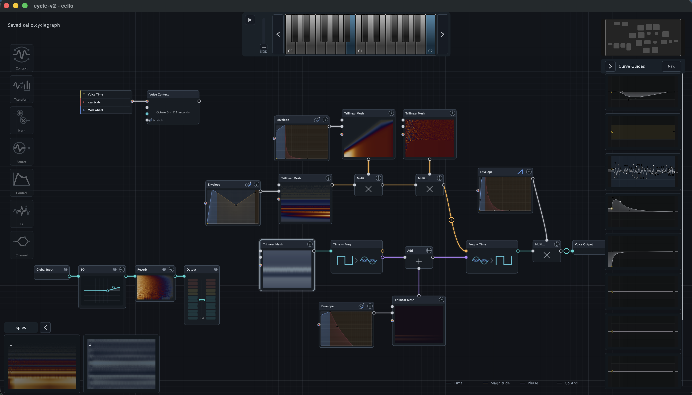
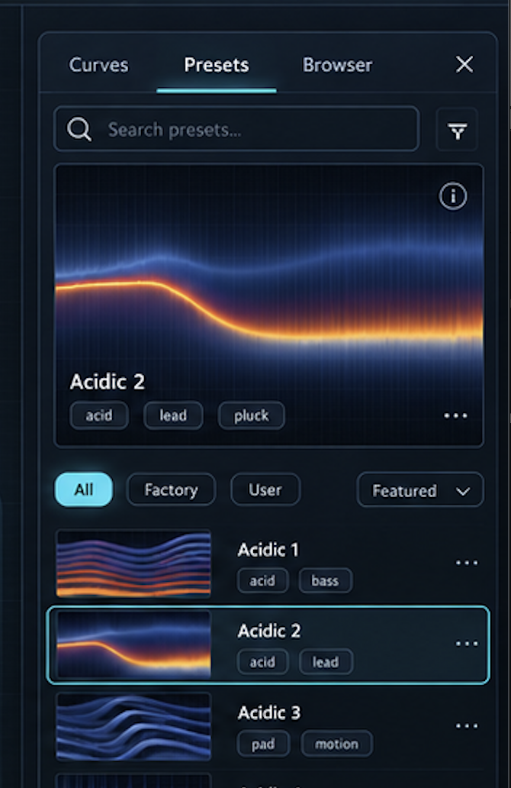
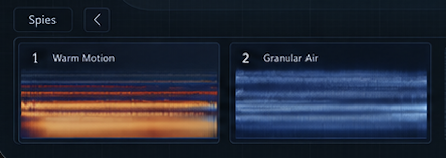
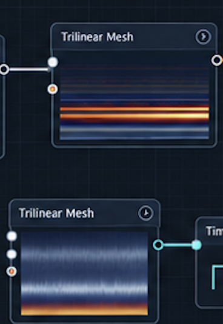
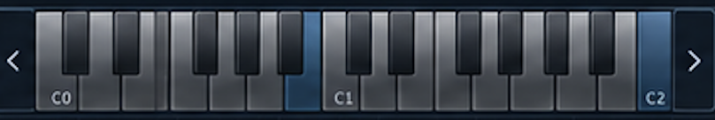
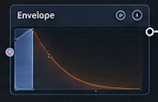
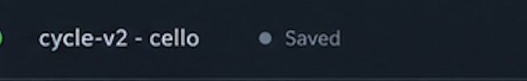
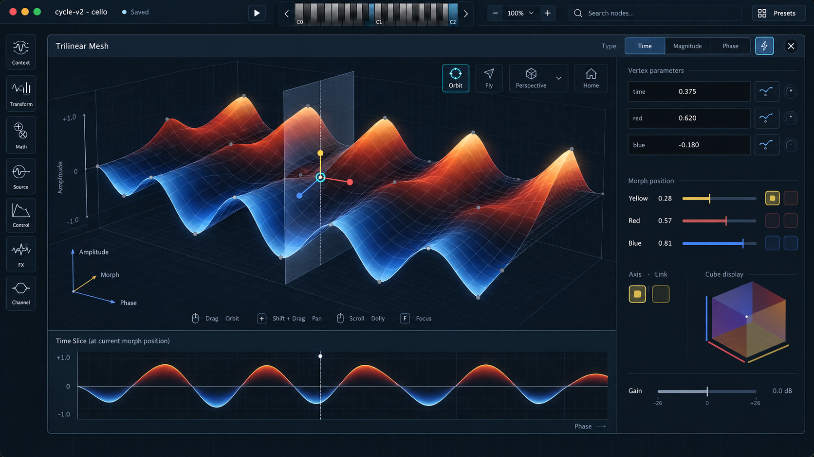

# Cycle V2 Visual Language Convergence

Status: Proposed

## Objective

Bring Cycle V2's workspace chrome, compact nodes, keyboard, envelopes, signal
spies, and expanded Trimesh presentation into the richer design language
established by the preset browser exploration. The result should remain a
precise node editor: spectral and signal imagery may be vivid, while persistent
chrome stays quiet, aligned, and subordinate to authored graph content.

This TDD coordinates presentation only. Existing graph, DSP, serialization,
undo, preview-capture, MIDI, and editor-interaction contracts remain
authoritative.

## Baseline And Reference Intent

### Current workspace

The current workspace establishes the real density, graph scale, utility
placement, and production-size constraints. Mockups may not justify making
nodes, typography, or controls substantially larger than this baseline.

### Browser, signal observations, and compact nodes

| Preset-browser language | Numbered signal observations | Compact Trimesh treatment |
| --- | --- | --- |
|  |  |  |

- Reuse the browser's deep-navy surface hierarchy, restrained cyan focus, soft
  inner boundary light, compact rounded controls, and image-first balance.
- Signal spy cards show signal state at processing stages. Keep their numbers;
  do not assign preset-like names. Source or processing-stage identity may
  appear contextually on hover, selection, or expanded detail.
- Compact Trimesh imagery remains the information-bearing centre of the node.
  The signed time-domain material is specified in
  [cycle-v2-scalar-surface-shader.md](cycle-v2-scalar-surface-shader.md).

### Boundary and top-bar details

| Keyboard boundary light | Envelope edit-region light | Unified document status |
| --- | --- | --- |
|  |  |  |

These snippets specify restrained edge definition, not a general neon-glow
effect. Brightness belongs at material boundaries, focus, and editable-region
edges; broad panels remain matte and low contrast.

### Perspectival Trimesh direction

This is directional interaction and hierarchy evidence, not a pixel-perfect
layout. Preserve the large manipulable surface, visible zero crossing, compact
camera controls, selected slice plane, and exact linked 2D slice. Reduce glow
and ornamental controls when adapting it to the production component system.

## Design System Contract

### Surface hierarchy

Use the existing `CanvasChromePalette` as the single named source for canvas,
dock, raised, resting-control, hover, focus, and border colours. Extend that
vocabulary only when the same new role is used by multiple components.

One container should normally contribute one inset and one boundary. Avoid
stacked rounded rectangles, repeated inner padding, and unrelated glow layers.
Information-bearing previews may have greater local contrast than their node or
dock shell.

### Boundary light

- Use a dark outer boundary plus at most one subtle one-pixel inner highlight
  at production scale.
- Selected or keyboard-focused objects may add a narrow cyan outline. Hover is
  weaker than focus, and ordinary resting components do not glow cyan.
- Piano key divisions and Envelope editable-region edges may receive a soft
  light-facing highlight that preserves their geometry at compact sizes.
- Boundary light must not obscure the exact Envelope curve, selected point,
  piano-key state, port colour, or signal preview.
- Disabled state remains legible and cannot be expressed only by reducing
  opacity.

### Colour ownership

Preserve the three established semantic colour systems:

- yellow, red, and blue identify morph axes;
- cyan, butterscotch, purple, and neutral control lines identify signal
  domains; and
- Envelope section colours identify its time regions.

Chrome must not borrow these colours merely for decoration. Cyan remains the
global focus/primary-action accent, while node previews use their domain-owned
palette. Selection also requires geometry or contrast and never relies on
colour alone.

## Unified Top Bar

The title, document state, preview transport, performance keyboard, zoom,
search, and preset entry belong to one visually continuous global bar rather
than separate floating islands.

At the normal production width:

- the bar is one compact 48--54 px band below the native window frame;
- document title and status occupy the leading group;
- the performance keyboard is the central information-bearing object and
  retains recognizable key proportions from
  [cycle-v2-performance-keyboard-proportions.md](cycle-v2-performance-keyboard-proportions.md);
- zoom, search, and preset actions form the trailing group; and
- related controls use 6--8 px internal gaps, while group changes use 14--18 px
  gaps or a restrained divider.

`Saved`, `Saving...`, modified, and error states use an icon or dot plus text so
state is not colour-only. The bar may collapse search before distorting the
keyboard. At narrow widths, preserve document identity, state, and playback
before optional actions.

`CanvasUtilityDock` and `PerformanceKeyboard` retain keyboard geometry and MIDI
interaction ownership until a deliberate layout extraction moves the same
component into the bar. Do not copy key geometry, hit testing, note state, or
transport behavior into a new toolbar widget.

## Compact Node And Envelope Treatment

- Keep the existing node header/content division, port positions, node title,
  selection model, and canvas zoom behavior.
- Apply the shared surface hierarchy and boundary-light primitive rather than
  special-case painting in each node family.
- Preview content receives the majority of the compact node's interior area.
  Headers remain readable at production zoom without adopting mockup-scale
  typography.
- Envelope attack/hold/decay regions may use a soft illuminated seam at an
  actual authored boundary. The curve and vertex marker remain sharper than
  the seam, and no light is invented where no boundary exists.
- Piano keys share one geometry source. The new material treatment may brighten
  key edges and active keys but cannot change white/black-key proportions,
  overlap, or hit targets.

## Signal Spy Cards

`SignalProbeRail`, its preview cache, and the existing implicit output spy
remain authoritative for signal acquisition, ordering, refresh, and
Time/Spectrum mode.

- Cards are numbered in source-to-sink order and have no persistent preset
  names.
- The image remains dominant; numbers are small orientation marks rather than
  titles.
- A stage label may appear in hover help or selected detail if graph context is
  otherwise ambiguous.
- Time/Spectrum state remains evident through the rendered content and existing
  interaction; do not add a repeated mode label to every resting card.
- Browser-card chrome may be reused, but browser selection, tags, overflow
  actions, and preset metadata must not leak into spy semantics.

## Preset Browser

The implemented preset browser remains the primary style reference and retains
its asynchronous index, lazy thumbnail cache, keyboard navigation, loading
states, and embedded-preview contract from
[cycle-v2-preset-browser-previews.md](cycle-v2-preset-browser-previews.md).

Visual convergence should extract shared palette, focus-ring, card-surface, and
compact-control primitives where doing so deletes duplicate paint policy. It
must not move browser-specific search, selection, metadata, or loading behavior
into generic canvas chrome.

## Perspectival Trimesh Workspace

The expanded Trimesh editor may later offer an orbitable smooth surface with a
linked exact slice:

- Orbit is the safe default; Fly is an optional advanced navigation mode.
- Home/reset, focus selection, projection mode, and orientation reference keep
  camera freedom recoverable.
- Positive and negative amplitude cross a visible zero plane geometrically and
  chromatically.
- A selected morph position shows one slice plane and one exact 2D trace using
  the same scalar data.
- The exact 2D slice remains available for value judgement even when the camera
  is oblique.
- Editing gestures retain undo, stable selection, and current Trimesh semantic
  commands. Camera movement does not mutate the mesh.

Reuse the mature Cycle 1 `Interactor3D`, `Panel3D`, and Trimesh slicing behavior
or extract their shared core. Do not reproduce orbit math, hit testing, mesh
traversal, or slice evaluation inside a Cycle V2 adapter. Record the mature
pointer-down, movement, and commit cost before changing interaction.

## Ownership And Relationship To Existing TDDs

- `cycle-v2-workspace-visual-hierarchy.md` remains authoritative for canvas
  priority, expanded-editor occlusion, utility placement, and semantic colour
  systems.
- `cycle-v2-performance-keyboard-proportions.md` remains authoritative for key
  geometry and gesture behavior.
- `cycle-v2-preset-browser-previews.md` remains authoritative for browser data,
  preview generation, indexing, and browser interaction.
- `cycle-v2-spy-rail.md` and `cycle-v2-spy-rail-preview-caching.md` remain
  authoritative for spy semantics, ordering, refresh, and caching.
- `cycle-v2-scalar-surface-shader.md` owns live scalar-surface material and GPU
  rendering.
- `CanvasChromePalette` owns shared chrome roles. Domain render profiles own
  preview colours.

No high-level component may grow a node-kind switchboard to apply this visual
language. Shared primitives may own paint geometry and state appearance; node
families retain their domain content and interactions.

## Implementation Slices

1. Inventory production-size chrome roles and consolidate shared palette,
   one-pixel boundary, focus-ring, and card-surface primitives. Preserve
   behavior and capture before/after evidence.
2. Converge compact node shells, Envelope regions, and piano-key material while
   preserving domain geometry and hit targets.
3. Compose the unified top bar by moving the existing keyboard component and
   routing existing document, transport, zoom, search, and preset actions. Do
   not reimplement their behavior.
4. Restyle spy cards with numbered signal semantics and contextual stage help.
5. Integrate the scalar-surface shader in compact and expanded Trimesh views.
6. Create a separate interaction slice for the navigable 3D Trimesh editor only
   after shared-core reuse and gesture complexity are designed and tested.

Each slice must complete implementation, production-size review, refactor,
style, focused semantic tests, architecture audit where required, and a
coherent commit before the next slice begins.

## Verification

- Capture the ordinary workspace, preset browser, compact Trimesh and Envelope
  nodes, keyboard hover/press, non-empty spy rail, and expanded editor at the
  same window size, display scale, and state before and after each slice.
- Geometry tests assert the top-bar group bounds, opposing insets, keyboard
  proportions, node preview bounds, and spy-card image/number placement.
- State tests cover resting, hover, selected, keyboard focus, disabled,
  modified, saving, saved, and error presentation without colour-only state.
- Existing complete gesture tests remain green for keyboard notes, Envelope
  editing, spy mode toggling, preset selection/loading, graph selection, and
  expanded-editor dismissal.
- High-contrast and reduced-transparency review preserves readable labels,
  focus, ports, and document state.
- Screenshots prove that boundary highlights remain narrow at 1x and high-DPI
  scales and do not bloom into broad cyan halos.
- `git diff --check`, focused tests, standalone build, scalar-math hot-loop
  review for visualization changes, file-size review, and
  `scripts/cycle_v2_architecture_audit.py` pass before each production commit.

## Completion Criteria

- The preset browser, graph workspace, nodes, keyboard, Envelope editors, and
  spy cards read as one product at production size.
- The unified top bar communicates document and playback state without
  distorting the keyboard or duplicating controls.
- Bright edges clarify real boundaries and focus but never become general
  decoration.
- Spy cards read as numbered signal observations, not named presets.
- Bipolar time surfaces read immediately as blue troughs, neutral zero, and
  orange peaks, with derivative detail subordinate to amplitude.
- The 3D editor direction has an explicit shared-core and interaction plan
  before implementation; no visual mockup is mistaken for completed behavior.
- Superseded paint branches and duplicated palette constants are deleted rather
  than retained behind another facade.
