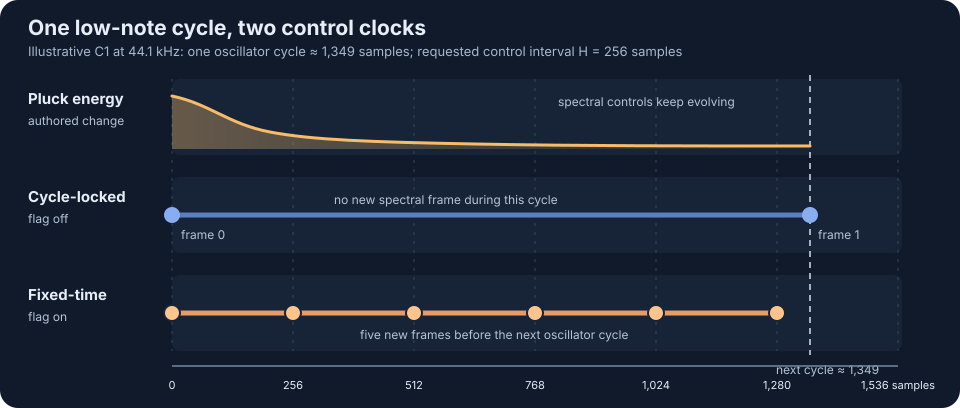
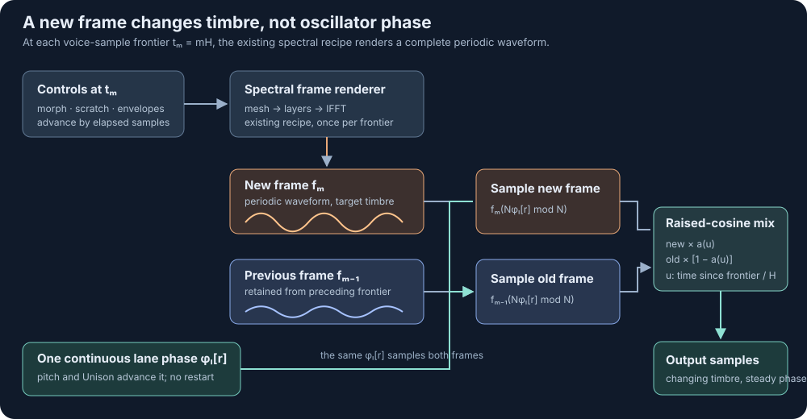

# Pitch-Independent Spectral Frame Control

## Status

In progress. The experimental Cycle V2 path is implemented behind the
`pitchIndependentSpectralControl` Voice Context flag. The legacy path remains
the default. Cycle 1 integration and the full shipping-quality interval and
polyphony measurement matrix remain open, so this TDD is not complete.

## Experimental Cycle V2 Implementation

Implemented 2026-09-16:

- `FixedTimeFrameClock` owns the pitch-independent absolute voice-sample
  frontiers, and `FixedTimeCyclicFrameCompositor` owns periodic Hermite lookup,
  phase-aligned two-frame composition, and complementary raised-cosine weights
  in the shared Cycle DSP library.
- `SpectralOscillatorRegionRuntime` selects the fixed-time path only when the
  compiled Voice Context flag is true. It continues to invoke the existing
  `SpectralOscillatorFrameRenderer` once per frontier, retaining its mature
  morph, scratch, rasterization, FFT, layer, harmonic-cutoff, and IFFT order.
- Each prepared runtime retains two frames and a precomputed transition table.
  Lane phase is continuous and lane-local; rendered frames remain shared across
  Unison lanes. The realtime path allocates and locks zero times after prepare.
- `acoustic-high-control-rate.cyclegraph` is a copy of Acoustic with the flag
  enabled and a 64-sample interval. The original Acoustic preset remains on its
  256-sample legacy whole-cycle cadence.
- The expanded Voice Context properties expose the experimental flag beside
  the control interval. Scratch and morph inputs resolve at each fixed-time
  frontier; the cycle-envelope bank advances by the elapsed samples there.

The application boundary translates compiled Voice Context configuration,
process timing, and rendered frame buffers into the shared clock/compositor.
It does not copy spectral or mesh-domain behavior. The stable end state is for
Cycle 1 to consume this same shared core before the flag becomes a general
shipping quality mode; no V2-only spectral renderer was introduced.

Focused evidence:

- MIDI 21 renders eight frames in the first 512 output samples at a 64-sample
  interval, before the first oscillator cycle completes.
- Output and frame counts are byte-identical for host blocks of 1, 16, 64,
  127, 256, and 512 samples.
- Events immediately before and on a frontier are visible to that frontier;
  an event immediately after it waits for the following frontier.
- Frame-render count remains eight when Unison order increases from one to
  four, while lane phase and stereo pan remain lane-local.
- Shared-DSP tests cover clock sequences, complementary weights, identical
  frames, opposite frames, phase-locked lookup, and periodic wrap.

One-voice Debug measurements at 44.1 kHz with 512-sample callbacks recorded no
deadline overruns. Legacy Acoustic averaged 0.916 ms per callback and 7.85%
deadline utilization over 44 callbacks. The 64-sample experimental copy
averaged 2.091 ms and 17.97% over 46 callbacks, producing exactly eight recipe
renders per active callback. These measurements justify keeping the mode
opt-in; they do not select a shipping default. The reproducible automation
fixture is `scripts/fixtures/cycle-v2-agent-acoustic-fixed-time-control.json`.

### C1 control-interval comparison (2026-09-16)

Two realtime passes used the same Acoustic graph with its Voice Context octave
offset set to zero, MIDI C1 (note 24), one voice, velocity 0.8, and only the
control interval and experimental flag varied. The macOS standalone Debug build
ran at 44.1 kHz with 512-sample callbacks (11.61 ms deadline). Each measurement
window covered about 0.38 seconds after note startup. Means below are weighted
by measured callback count across the two passes; recipe renders are per callback.

| Interval | Flag off: mean callback / recipes | Flag on: mean callback / recipes | Flag on: deadline use / worst callback |
| --- | ---: | ---: | ---: |
| 16 samples | 0.436 ms / 0.36 | 9.014 ms / 32.00 | 77.6% / 9.678 ms |
| 64 samples | 0.389 ms / 0.38 | 2.463 ms / 8.00 | 21.2% / 2.692 ms |
| 256 samples | 0.662 ms / 0.39 | 2.111 ms / 2.00 | 18.1% / 2.387 ms |
| 1024 samples | 0.705 ms / 0.37 | 1.222 ms / 0.51 | 10.5% / 2.016 ms |

There were no deadline overruns or telemetry drops in the 16 measurements.
With the flag off, all four settings are clamped to at least one oscillator
cycle between frames at C1, so their recipe counts are effectively identical;
their small callback-time differences reflect short realtime windows and
background load. The 16-sample fixed-time mode leaves little headroom for
additional voices in this Debug run. These are one-voice measurements, not a
shipping polyphony limit.

This design extends Cycle's spectral oscillator with a control-frame cadence
that may be shorter than one oscillator cycle. It does not replace the existing
spectral renderer with convolution, change the authored spectral-layer model,
or define dynamic-impulse behavior for the IR Modeller.

## Objective

Give low notes the same responsive spectral modulation available to higher
notes. Time, magnitude, and phase meshes should be sampled at a configurable
time-domain cadence even when one oscillator period is longer than that control
interval.

The output must retain Cycle's existing pitch-locked periodic waveform,
spectral-layer ordering, cyclic IFFT semantics, unison phase behavior, and
host-block independence. A control update must not restart oscillator phase or
turn a periodic frame into a causal FIR response.

## Current Limitation

Cycle chooses an integer number of oscillator cycles between spectral frame
updates. `OscillatorLaneCore::controlFrameStride()` rounds the configured
sample interval to a cycle count and clamps that count to at least one. Cycle 1
and the prepared Cycle V2 spectral runtime then advance their shared frame
frontier by the neutral cycle period multiplied by that stride.

For a high note, one or more cycles approximate the configured control
interval. For a low note whose period is longer than the interval, the clamp
reduces the update cadence to the note frequency. A 27.5 Hz note therefore
cannot receive more than approximately 27.5 distinct spectral frames per
second even when the configured control interval asks for a substantially
higher rate.

The pluck-energy curve is schematic. The dots show frame-render frontiers, not
output samples: the legacy path cannot render a second spectral state inside
this cycle, while the fixed-time path can.

The current renderer interpolates previous and current frames and performs a
half-frame seam fade, but it composes a complete oscillator cycle before
resampling it. The interpolation amount is selected for that cycle. It cannot
express a spectral transition that begins and completes within one long bass
cycle.

## Authoritative Implementations

The implementation must extend or extract these existing owners rather than
reproduce their behavior:

- `cycle/src/Audio/Voices/CycleBasedVoice.cpp` owns Cycle 1 frame-frontier,
  envelope, scratch, unison, pitch-clock, and output-resampling behavior.
- `cycle/src/Audio/Voices/SynthFilterVoice.cpp` owns the mature ordering of time
  rasterization, forward FFT, magnitude layers, phase layers, harmonic cutoff,
  inverse FFT, and cyclic oversampling.
- `cycle-v2/src/Runtime/SpectralOscillatorRegionRuntime.*` owns prepared Cycle
  V2 spectral-frame scheduling, shared-frame state, lane-local output state,
  and block-independent frontier advancement.
- `cycle-v2/src/Runtime/SpectralOscillatorFrameRenderer.*` owns prepared frame
  generation and its adapters to the shared rasterization and spectral cores.
- `lib/src/Audio/CycleDsp/OscillatorLaneCore.*` owns shared pitch and lane-clock
  calculations.
- `lib/src/Audio/CycleDsp/CyclicFrameLaneRenderer.*` owns existing periodic
  frame interpolation, phase rotation, and half-frame carry.
- `TrimeshMorphResolver`, `Rasterization::ScratchPositionPolicy`,
  `OscillatorLaneRasterizer`, and `SpectralLayerCore` retain their existing
  modulation, scratch, rasterization, and spectral-domain responsibilities.

The first implementation step must characterize the Cycle 1 and Cycle V2
production outputs at and around a frame transition. This establishes which
existing half-frame behavior is deliberate seam suppression and which behavior
is an artifact of whole-cycle scheduling.

## Why Dynamic Convolution Is Not The Oscillator Model

### Time-varying IR policies

A partitioned convolver may bind an impulse-response version to the input block
that arrived while that version was active:

\[
Z_n = \sum_{p=0}^{P-1} X_{n-p}H_p^{v(n-p)}.
\]

After inverse transformation, overlap-add contributes the second half of the
previous aggregate block. This is a valid source-time-varying system: every
input block launches a response whose entire tail belongs to its original IR.
In sample notation,

\[
y[r] = \sum_m x[m]h_{v(m)}[r-m].
\]

It differs from an output-time-varying FIR,

\[
y[r] = \sum_{\ell} h_{v(r)}[\ell]x[r-\ell],
\]

whose block approximation applies the output block's current IR version to all
input-history partitions:

\[
Z_n = \sum_{p=0}^{P-1} X_{n-p}H_p^{v(n)}.
\]

Both are meaningful dynamic-IR policies. Crossfading complete convolver states
defines another policy. Selecting among them belongs in a separate IR Modeller
design because it determines whether old tails finish, change immediately, or
fade between kernels. The current Cycle V2 configuration policy resets an IR
convolver when a changed impulse is adopted and does not preserve or crossfade
the old tail.

### Spectral-layer mismatch

Convolution is equivalent to spectral processing only when the operation is an
input-independent complex multiplication:

\[
Y[k] = X[k]G[k], \qquad g = \operatorname{IFFT}(G).
\]

Cycle's complete spectral result is not generally of this form. Subtractive
magnitude layers multiply existing magnitudes, but additive magnitude layers
create spectral energy and phase layers independently accumulate phase
offsets. Per-layer pan may also create distinct channel spectra. Calculating
`G[k] = Y[k] / X[k]` after the fact is undefined at zero-valued input bins,
makes additive content depend on the excitation, and only repackages a result
that Cycle has already rendered.

Cycle's IFFT also reconstructs one periodic waveform. Multiplication of its
DFT bins corresponds to length-N circular convolution, whereas an IR effect
performs causal linear convolution and retains a physical tail. Replacing the
oscillator pipeline with a partitioned convolver would therefore change the
domain model rather than increase its control rate.

## Proposed Signal Model

### Fixed-time frame frontiers

Let the spectral control interval be `H` output samples. Generate spectral
frames at absolute voice-sample frontiers

\[
t_m = mH.
\]

At frontier `t_m`:

1. advance live modulation, morph smoothing, and scratch by the exact elapsed
   sample count;
2. rasterize the time-domain mesh and run the existing spectral-layer pipeline;
3. inverse-transform the result into a complete periodic frame `f_m`;
4. make `f_m` the target of a bounded transition from the preceding periodic
   frame.

The frame clock is independent of host block boundaries. Events dispatched at
a frontier are visible to that frontier according to the existing prepared
process-context rule. An event after the frontier must not be observed early.

### Phase-locked cyclic overlap

Each lane retains one continuous oscillator phase `phi_l[r]`. Adjacent frames
are evaluated at that same phase and blended in output-sample time:

The signal snippets align one steady-pitch output cycle with the phase domain of
each complete IFFT frame. A row shows a reusable periodic waveform, not a grain
placed on the output timeline. The control interval `H` determines when a new
whole-cycle frame is rendered and how long the blend to it lasts; the IFFT
frame itself still spans the entire oscillator cycle. At `2.5H`, both `f_1` and
`f_2` are sampled at the same lane phase and mixed equally.

\[
y_l[r] =
(1-a[r])f_{m-1}(N\phi_l[r] \bmod N)
+a[r]f_m(N\phi_l[r] \bmod N).
\]

For a transition over one control interval, the initial window policy should
be the complementary raised-cosine pair

\[
a[r] = \frac{1-\cos(\pi u)}{2}, \qquad
u = \operatorname{clamp}\left(\frac{r-t_m}{H}, 0, 1\right).
\]

More generally, the compositor is a cyclic weighted overlap-add system:

\[
y_l[r] =
\frac{\sum_m w_m[r]f_m(N\phi_l[r] \bmod N)}
     {\sum_m w_m[r]}.
\]

Only two adjacent frames need overlap for the initial implementation. The
weights must form a partition of unity so a sequence of identical frames is
sample-identical to rendering one fixed frame, apart from any already
characterized legacy seam behavior.

This is not an ordinary inverse STFT that places independent IFFT grains on an
absolute timeline. Each `f_m` remains a periodic phase-domain function. The
compositor samples all active functions using the lane's continuous pitch
phase, which preserves low fundamentals even when `H` is much shorter than one
period.

### Causality and transition latency

The initial policy is causal. A frame rendered from state visible at `t_m`
becomes the transition target at `t_m` and reaches full weight by `t_m + H`.
This adds smoothing delay but no lookahead. Centered windows that begin before
`t_m` would require either control lookahead or a declared output latency and
are outside the initial implementation.

Internal envelopes might be predictable, but MIDI and external controls are
not. The implementation must not use future internal state for some sources
while silently delaying or clamping others.

## Cyclic Reconstruction Contract

- An IFFT frame is indexed modulo its fixed power-of-two frame size.
- Rendering a new frame does not restart oscillator phase.
- Both transition frames are sampled at the same lane phase before weighting.
- Pitch envelope, detune, initial phase, resampling spillover, and interpolation
  history remain lane-local.
- The rendered frame pair, control frontier, mesh rasterization, and guide
  randomness are shared across compatible unison lanes.
- Oversampling uses the periodic frame's own wrapped continuation. It does not
  consume an acyclic tail from a preceding frame.
- The transition owns no FIR history. Its state is limited to the adjacent
  periodic frames, window progress, and existing bounded lane interpolation or
  resampling history.
- A note reset initializes frame and transition state deterministically and
  cannot expose samples from the preceding note.

## Architectural Boundary

Extract or extend a shared Cycle DSP compositor below both application
adapters. It may own:

- fixed-time control-frontier advancement;
- references to the current and preceding immutable periodic frames;
- complementary window progression;
- phase-locked sampling of those frames;
- bounded lane-local interpolation state.

It must not own or duplicate:

- graph traversal or control-buffer evaluation;
- morph resolution or scratch-domain policy;
- mesh rasterization;
- magnitude or phase layer semantics;
- FFT/IFFT implementation;
- note allocation, MIDI dispatch, or application publication;
- unison configuration or pitch-envelope evaluation.

Cycle 1 and Cycle V2 adapters provide resolved frontier input and invoke the
same frame renderer and compositor contracts. If the existing
`CyclicFrameLaneRenderer` can support both whole-cycle and fixed-time output
without mixing scheduling, sampling, and domain rendering, extend it. If not,
extract its periodic sampling and complementary-window mechanics into a shared
lower-level primitive consumed by both paths. Do not copy its phase rotation or
half-frame behavior into a V2-only class.

## Complexity Contract

For frame size `N`, control interval `H`, harmonic count `K`, and unison order
`U`:

- one shared control frontier may perform one existing frame rasterization and
  spectral render, with its existing `O(N log N)` transform component;
- frame-generation count is independent of `U`;
- output work is `O(U)` per channel per sample with at most two periodic frame
  lookups and one complementary blend per lane;
- advancing one output sample or one control frontier must not copy a complete
  frame;
- no work may scale with unrelated graph nodes or resources;
- all frames, windows, and lane scratch are allocated during preparation;
- audio processing performs no allocation, locking, model parsing,
  serialization, or graph traversal.

Sub-cycle rendering deliberately increases frame-generation work for low
notes. Before selecting a default interval, measure frame rasterization and FFT
cost per active voice at the largest supported frame size. The quality setting
must express an interval in samples or time, not a misleading rate value, and
must have a bounded worst-case realtime cost.

Repeatedly retaining complete historical versions of every spectral frame or
IR is not allowed. The cyclic compositor requires only the adjacent frame pair.

## Phase And Interpolation Policy

Time-domain blending of phase-aligned IFFT frames is the initial authority. It
is equivalent to linear complex-spectrum interpolation only when the blend
amount is constant across the reconstructed frame, due to IFFT linearity. A
sample-varying transition intentionally introduces modulation sidebands; that
is the audible consequence of changing timbre within a cycle, not an FFT
reconstruction error.

Interpolating magnitude and unwrapped phase separately would define different
behavior, including different cancellation and chirp characteristics. Do not
introduce that behavior as an optimization. It requires a separate product
decision and differential listening tests.

## Implementation Slices

### 1. Characterize the existing transition

Add a preallocated diagnostic or focused shared-DSP tests that capture:

- current and previous frame identity;
- control and cycle frontiers;
- interpolation amount;
- lane phase at the beginning and end of a generated cycle;
- the half-frame carry before and after composition;
- pitch-clocked output around a frame transition.

Cover static equal frames, deliberately opposite frames, phase-shifted unison,
and a transition crossing a host block boundary. Record which existing samples
must remain compatible.

### 2. Add a fixed-time frontier clock

Introduce a block-independent clock driven by absolute voice samples. It emits
every elapsed frontier exactly once, including multiple frontiers within one
host block and one frontier spanning successive short blocks. Thread the
existing typed prepared process context through each frame request.

Do not change output yet. Prove frontier sequences for host blocks of 1, 16,
64, 127, 256, and 512 samples.

### 3. Extract cyclic frame sampling

Make periodic frame lookup, lane phase, and interpolation history available to
a fixed-time compositor without duplicating the existing resampling behavior.
Verify that sampling one static frame through the extracted path matches the
current fixed-frame oscillator across notes, pitch-envelope movement, initial
phase, and block partitions.

### 4. Add two-frame complementary overlap

Retain one preceding and one target frame and blend their phase-locked samples
with the selected complementary window. Identical frames must null the
transition as an observable operation. A new target arriving at the next
frontier must replace only state whose ownership is explicitly defined; it
must not leave a third hidden frame or restart a lane clock.

### 5. Connect live spectral frame generation

At each fixed-time frontier, resolve modulation and scratch using their current
shared owners and invoke the existing spectral renderer exactly once. Preserve
the established order of time rasterization, FFT, magnitude layers, phase
layers, harmonic cutoff, and IFFT.

### 6. Integrate unison and lifecycle

Share each rendered frame pair across compatible lanes while retaining
lane-local phase, detune, pan, pitch, and output history. Cover repeated notes,
note stealing, configuration publication, channel layout, and lifecycle-seeded
guide randomness.

### 7. Select quality policy from measurements

Measure representative static and evolving presets at MIDI 21, 36, 48, 60,
and 84 with maximum supported polyphony and unison. Compare at least the
existing 16, 64, 256, and 1024-sample interval choices. Choose defaults only
after recording worst-case frame-generation counts, callback cost, and audible
transition behavior.

### 8. Validate Cycle 1 and Cycle V2 integration

Both engines must consume the shared compositor or a shared extracted core.
Run differential stage capture in this order:

1. resolved morph and scratch at fixed-time frontier;
2. rasterized time frame;
3. forward-FFT magnitude and phase;
4. post-layer magnitude and phase;
5. reconstructed periodic frame;
6. phase-clocked transition samples;
7. final pre-effect voice output.

The first unequal mature boundary determines the next correction. Do not
normalize, time-warp, or loosen thresholds to hide a scheduling difference.

## Test Plan

### Shared DSP tests

- Two identical periodic frames produce the same samples as one frame for
  every transition position.
- Complementary weights sum to one at endpoints and interior samples.
- A transition beginning halfway through a low-note cycle changes output before
  that cycle ends without discontinuity at the control frontier.
- Both frames are sampled at identical lane phase.
- Frame lookup wraps at the periodic boundary without an acyclic tail.
- Static sine, impulse-like, and asymmetric frames retain their pitch and
  phase across transitions.
- Output is identical for every host-block partition around a control frontier.

### Runtime tests

- A low note receives multiple distinct rendered frames per oscillator cycle
  when its period exceeds `H`.
- A high note receives the configured fixed-time cadence without duplicate
  frame renders at coincident cycle boundaries.
- Voice time, key, velocity, pressure, modulation wheel, MIDI CC, scratch, and
  morph smoothing are sampled at the defined frontier.
- A timed event before, on, and after a frontier follows the existing event
  visibility contract.
- Frame-render count is independent of unison order.
- Pitch-envelope movement does not move spectral control frontiers or restart
  transition progress.
- Two fully released repeated notes and two fresh-process renders are byte
  repeatable with fixed lifecycle seeds.
- Processing allocates zero bytes after preparation.

### Audible and integration tests

- A bass-note magnitude-envelope fixture demonstrates measurable spectral
  change within its first oscillator cycle.
- A fast phase-layer fixture remains continuous and does not reset pitch phase
  at frame frontiers.
- Filter Saw, PWM, Dunk 2, Japan Drum, and one deterministic unison preset are
  compared with the legacy whole-cycle mode at low and high notes.
- A static spectral reference and pure FFT round trip remain exact.
- Existing Cycle 1/Cycle V2 stage-capture and block-partition tests remain
  passing.

## Negative Boundaries

- Do not replace spectral layers with an impulse response or partitioned
  convolver.
- Do not use a short ordinary STFT whose FFT-bin resolution cannot represent
  the low-note harmonic basis.
- Do not place each IFFT frame as an independently phased time-domain grain.
- Do not reset oscillator phase, oversampling state, or resampling history at a
  spectral control frontier.
- Do not render frames once per lane.
- Do not update once per host block or derive cadence from block size.
- Do not look ahead into MIDI or external controls.
- Do not interpolate phase independently without an explicit product decision.
- Do not add a V2-only rasterizer, spectral compositor, or modulation policy.
- Do not allocate, lock, parse models, traverse the graph, or publish state on
  the audio thread.
- Do not claim completion from a smoother waveform display; assert rendered
  audio, spectral frames, frontier counts, and lifecycle behavior.

## Open Design Questions

1. Should the first shipping mode use a raised-cosine transition over exactly
   `H` samples, or a shorter transition followed by a target-only hold?
2. Should the existing half-frame seam fade remain outside the new compositor,
   be subsumed by it, or apply only to legacy whole-cycle mode?
3. What maximum FFT/rasterization work per voice is acceptable, and which
   control intervals satisfy that bound on supported systems?
4. Should Cycle retain an explicit legacy whole-cycle quality mode for preset
   compatibility?
5. When a new target arrives before a prior transition completes under a future
   variable-hop policy, should the compositor snapshot the audible mixture or
   retain more than two source frames? The fixed-hop initial implementation
   should avoid this case by making transition duration no greater than `H`.
6. Can the existing frame-size and resampling policy remain fixed for the
   lifetime of every note under all supported pitch-envelope ranges?

## Completion Criteria

- Low notes can render and audibly consume more than one spectral frame per
  oscillator cycle.
- Spectral frame cadence is defined in absolute voice samples and is independent
  of pitch and host block partitioning.
- Existing rasterization, spectral-layer, FFT/IFFT, scratch, morph, and unison
  owners are reused without copied domain behavior.
- The oscillator retains continuous lane phase and cyclic frame semantics.
- Static content is sample-identical to the accepted static reference.
- Timed modulation follows the established causal frontier contract.
- Frame generation is shared across unison lanes and processing performs no
  realtime allocation or locking.
- Cycle 1 and Cycle V2 consume one shared compositor core or a documented
  common lower-level extraction.
- Worst-case CPU measurements justify the shipped interval choices.
- Focused sequence, block-partition, lifecycle, allocation, stage-capture, and
  audible regression tests pass.

## Deletion Targets

- Remove the assumption that a spectral frame frontier must be an integer
  number of complete oscillator cycles when pitch-independent control is
  enabled.
- Remove any temporary application-local fixed-time scheduler after the shared
  frontier owner exists.
- Remove any temporary V2-only cyclic blend or sample-loop implementation after
  the shared compositor extraction is complete.
- Remove diagnostic-only transition capture from production builds once stable
  test hooks own the observation boundary.
- Remove any quality label or variable name that describes a sample interval
  as a rate without an explicit conversion.

## References

- V. Lazzarini, E. Costello, J. Timoney, and V. Välimäki, “Live Convolution
  with Time-Varying Filters,” *Applied Sciences*, 2018:
  <https://www.mdpi.com/2076-3417/8/1/103>.
- P. Balazs, M. Dörfler, F. Jaillet, N. Holighaus, and G. A. Velasco, “Theory,
  implementation and applications of nonstationary Gabor frames,” *Journal of
  Computational and Applied Mathematics*, 2011:
  <https://pmc.ncbi.nlm.nih.gov/articles/PMC3257872/>.
