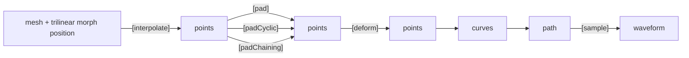
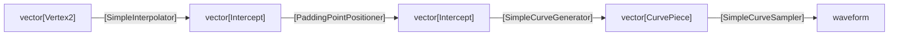
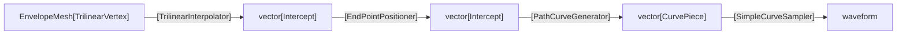
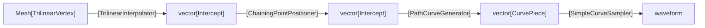
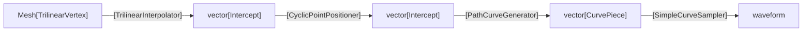

## Curves

## High-Level Pipeline

Mesh Raserization Refactor.

## Class Diagram (Desired, post-refactor)

CurvePiece becomes a 'sampleable' union of a CurvePath or a Curve

### Rasterizer2D becomes 

### EnvRasterizer becomes

### VoiceMeshRasterizer becomes

### GraphicRasterizer becomes

