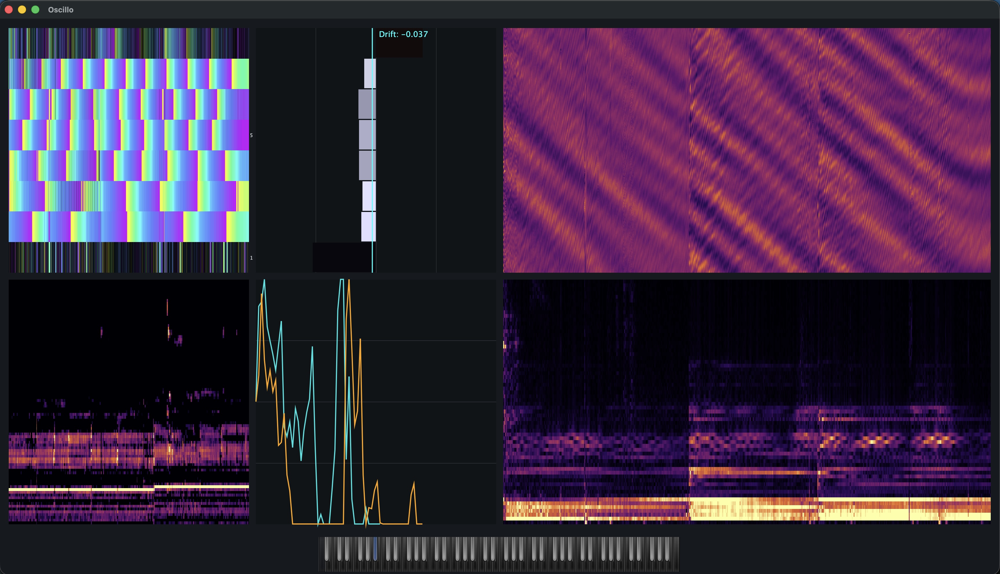

# Oscillo

Oscillo is a standalone piano tuner and pitch-analysis utility.
It listens to microphone input, tracks the detected pitch in real time, and
visualizes the signal as period history, spectral content, harmonic phase
motion, pitch drift, and note history against a keyboard reference.



## Purpose

Oscillo is a practical tuning and analysis companion rather than a synth. It is
useful when inspecting piano notes, comparing drift over repeated strikes, and
watching how harmonics move around the currently selected or detected note.

The app reuses `AmaranthLib` for shared audio, FFT, pitch tracking, buffer, UI,
and utility infrastructure, while keeping its own compact standalone UI and
installer manifest.

## Key Source Files

- `src/Main.cpp`: JUCE app entry point.
- `src/MainComponent.*`: main UI, keyboard, plots, pitch toggle, and timer
  updates.
- `src/OscAudioProcessor.*`: microphone input, period extraction, onset events,
  and audio-thread buffering.
- `src/RealTimePitchTracker.h`: Oscillo-facing include for the shared pitch
  tracker.
- `src/RealTimePitchTrace.h`: pitch tracker trace listener interface.
- `src/TempermentControls.h`: temperament and pitch-reference controls.
- `src/GradientColorMap.h`: plot colour maps.
- `installer.json`: product manifest consumed by the shared installer.

## Build

From the repository root:

```sh
cmake --preset standalone-debug
cmake --build --preset standalone-debug --parallel 10
```

On macOS, the debug app is written to:

```text
build/standalone-debug/oscillo/Oscillo.app
```

## Test

Oscillo tests are included in the root test preset:

```sh
cmake --preset tests
cmake --build --preset tests --target Oscillo_tests --parallel 10
ctest --preset tests -R Oscillo
```

For DSP trace/debug rendering in tests:

```sh
cmake --preset tests-dsp-trace
cmake --build --preset tests-dsp-trace --target Oscillo_tests --parallel 10
```

## Packaging

Oscillo packages through the shared installer system:

```sh
cmake --build --preset standalone-release --target Oscillo_installer_zip --parallel 10
```

The target reads `oscillo/installer.json` and writes
`build/packages/Oscillo.zip`.
